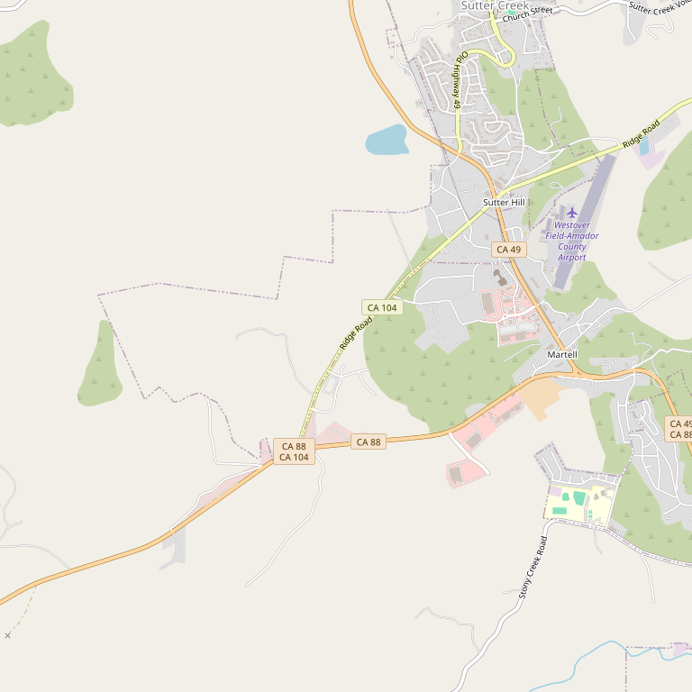

# Amador Heights Wine

> *Certified organic vineyard with Vino Tahoe and Pansaré labels*

## Location

## Overview

| Field | Value |
|-------|-------|
| **Location** | Sutter Creek, Amador County |
| **AVA** | Amador County |
| **Labels** | Vino Tahoe, Pansaré Cellars |
| **Varietals** | 14 grown |
| **Elevation** | 1,860 ft (Ridge Road) |
| **Farming** | Certified Organic |
| **Style** | Minimal intervention (Pansaré) |
| **Dog Friendly** | Yes |
| **Picnic Area** | Yes — Large area |

## Contact

- **Address:** Ridge Road, Sutter Creek, CA
- **Website:** https://www.vinotahoe.com
- **Tasting Room:** Check website for hours

## Wines

### Vino Tahoe Label
- Inspired by Sierra Nevada ski resorts
- Served at homeowner clubs in major ski resorts

### Pansaré Cellars Label
- Estate-grown grapes
- Minimal intervention — "just grapes and yeast"
- No additions or subtractions unless absolutely necessary

## Vineyards

14 varietals grown in a certified organic vineyard at 1,860 feet elevation on picturesque Ridge Road, with expansive vineyard views.

## Notes

The dual-label approach allows for both approachable wines (Vino Tahoe) and purist, minimal-intervention expressions (Pansaré).

The large picnic area with expansive views makes this ideal for extended visits.

### Amador's Only Certified Organic Vineyard
The **only CCOF certified organic estate vineyard in Amador County** — also the newest micro-winery in the Sierra Foothills.

**Awards:** Best of Class and multiple awards at SF Chronicle, Sunset International, and Orange County wine competitions.

**Summer Concert Series** features country music, soul food, award-winning wine, and gorgeous sunsets in the organic vineyard. Tickets required.

The Vino Tahoe label is served at homeowner clubs in major Sierra Nevada ski resorts — bringing foothill wine to the mountains.

## Visited

- [ ] Have not visited

## Rating

*Not yet rated*

---

*Last updated: 2026-03-21*
