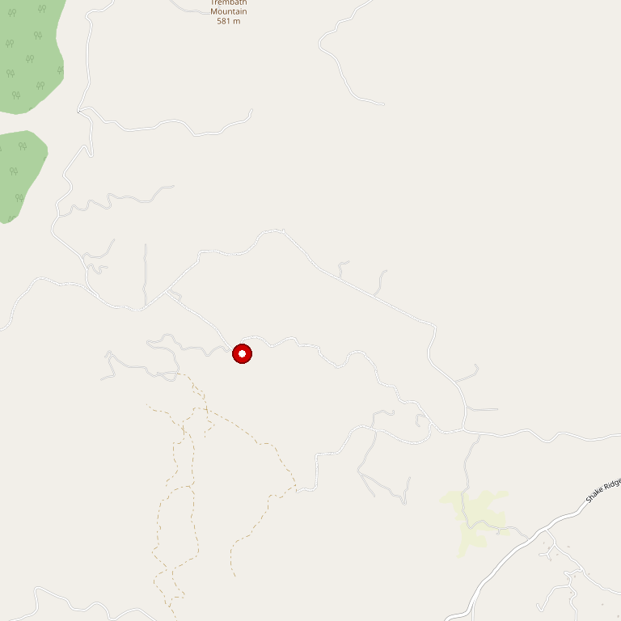

# Avio Vineyards

> *Classic Tuscan farmstead experience with Italian-style varietals*

## Location

## Overview

| Field | Value |
|-------|-------|
| **Location** | Sutter Creek, Amador County |
| **AVA** | California Shenandoah Valley |
| **Style** | Italian-style, smooth varietals |
| **Focus** | Pinot Grigio, Sangiovese, Zinfandel, Cabernet |
| **Lodging** | Carriage House available |
| **Dog Friendly** | Yes |
| **Picnic Area** | Yes (rustic courtyard) |

## Contact

- **Address:** 14520 Ridge Road, Sutter Creek, CA 95685
- **Phone:** (209) 267-1515
- **Website:** https://aviowine.com
- **Tasting Room:** Friday–Sunday 11am–5pm

## Wines

### Whites
- **Pinot Grigio** — Smooth Italian-style

### Reds
- **Sangiovese** — True Italian varietal
- **Cabernet Sauvignon** — Bold and robust
- **Zinfandel**
- Award-winning blends

## Signature Wines

Avio specializes in crafting smooth Italian-style wines including Pinot Grigio and Sangiovese, alongside robust reds like Cabernet Sauvignon and Zinfandel. Two award-winning blends round out the portfolio.

## History

Avio embodies the spirit of northern Italy. The winemaking family in Avio, Italy, has proudly produced exceptional wines for generations. The Amador County estate recreates the allure of a classic Tuscan farmstead.

## Notes

The picturesque rustic courtyard and enchanting Carriage House lodging create a complete Italian wine country experience. Located just five minutes from downtown Sutter Creek, this destination beats most Amador and Placer county wineries for ambience and view.

## Visited

- [ ] Have not visited

## Rating

*Not yet rated*

---

*Last updated: 2026-03-21*
