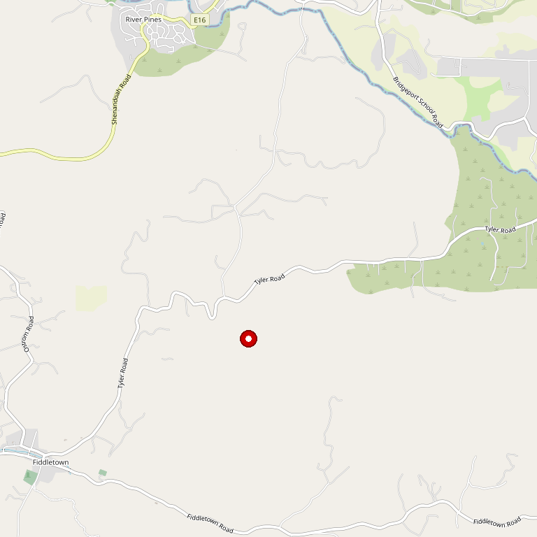

# Casino Mine Ranch

> *100-point winemaker on a Gold Rush ranch*

## Location

## Overview

| Field | Value |
|-------|-------|
| **Location** | Plymouth, Amador County |
| **AVA** | California Shenandoah Valley |
| **Owners** | Jim and Rich Merryman (4th-generation brothers) |
| **Winemaker** | Andy Erickson & Jessica Tarpy (100pt winemaker) |
| **Style** | Estate, premium |
| **Focus** | Estate-grown wines |
| **Dog Friendly** | Yes |
| **Picnic Area** | Yes |

## Contact

- **Address:** Plymouth area (check website)
- **Website:** https://www.casinomineranch.com
- **Tasting Room:** By appointment

## Wines

### Estate Wines
- Made by 100-point winemaker Andy Erickson & Jessica Tarpy
- Estate-grown from the property

## History

Casino Mine Ranch is an estate vineyard located in the Sierra Foothills of Amador County. The winery occupies a century-old ranch that was once mined for gold.

Owned and managed by **fourth-generation California brothers Jim and Rich Merryman**, the property represents deep family roots in Amador.

## Notes

Estate-grown wines made by **100-point winemaker Andy Erickson & Jessica Tarpy Shaheen** — a pedigree rarely found in Amador County. The Gold Rush history adds another layer to the experience.

### The Team
**Andy Erickson** is legendary in California wine — with Jessica Tarpy and Annie Favia, he also runs the experimental label ROOM. Jessica calls the patchwork of grape varieties on the ranch a "gumbo pot" and brings thoughtful farming to harness the site's potential.

**80+ years of history:** The Merryman family has transformed this century-old ranch (once mined for gold) for future generations. An unusual array of grapes grows here — a new history is being written.

**Varietals include:** Vermentino, Barbera, Zinfandel, and other Mediterranean varieties thriving at elevation.

**Address:** 10690 Shenandoah Road, Plymouth

## Visited

- [ ] Have not visited

## Rating

*Not yet rated*

---

*Last updated: 2026-03-21*
