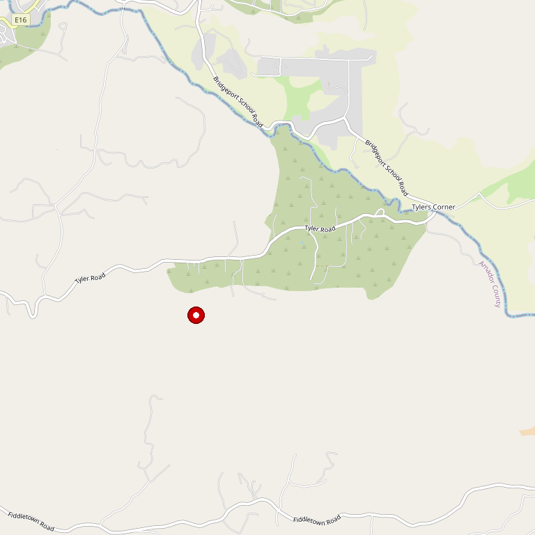

# C.G. Di Arie Vineyard & Winery

> *French, Portuguese, and Spanish varietals in an open-air courtyard*

## Location

## Overview

| Field | Value |
|-------|-------|
| **Location** | Plymouth, Amador County |
| **AVA** | California Shenandoah Valley |
| **Style** | French, Portuguese, Spanish varietals |
| **Focus** | Elegant blends, innovative |
| **Dog Friendly** | Yes |
| **Picnic Area** | Yes |
| **Events** | Amphitheater for cultural events |

## Contact

- **Address:** 19919 Shenandoah School Road, Plymouth, CA 95669
- **Phone:** (209) 245-4700
- **Website:** https://www.cgdiarie.com
- **Tasting Room:** Thursday–Monday

## Wines

### French Varietals
- Award-winning French-style wines

### Portuguese Varietals
- Port-style and table wines

### Spanish Varietals
- Elegant Mediterranean expressions

### Blends
- Artistic, award-winning blends

## Winemaking Philosophy

Famous for French, Portuguese, and Spanish varietals featuring elegant, artistic blends. Clusters are hand-selected and produced in small lots incorporating innovation and cutting-edge technology.

## Notes

The outdoor tasting room sits in a romantic open-air courtyard shaded by majestic oak trees. An amphitheater hosts cultural events throughout the year.

## Visited

- [ ] Have not visited

## Rating

*Not yet rated*

---

*Last updated: 2026-03-21*
