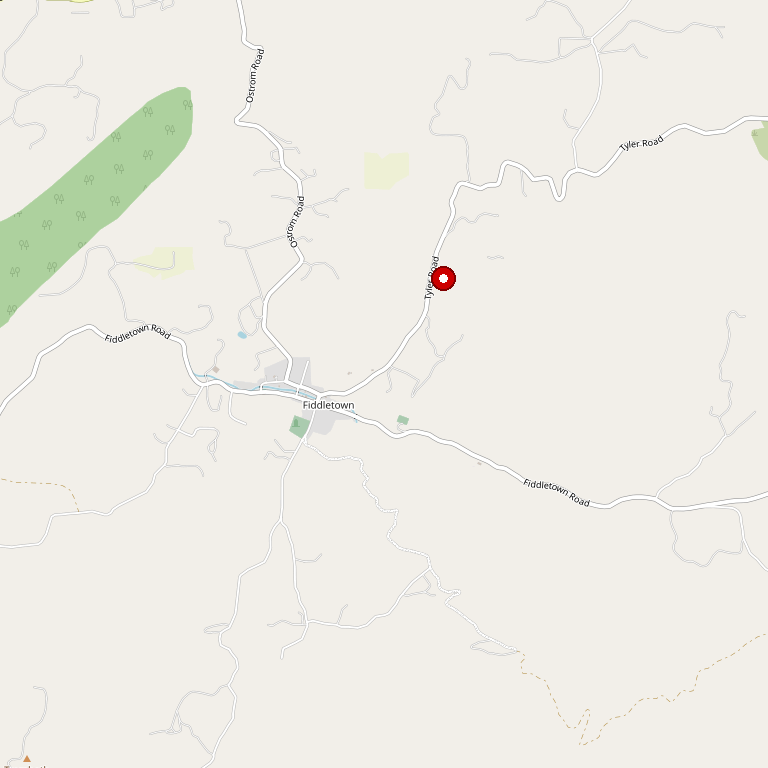

# Cooper Vineyards

> *17 varietals under four daughters' stewardship*

## Location

## Overview

| Field | Value |
|-------|-------|
| **Location** | Plymouth, Amador County |
| **AVA** | California Shenandoah Valley |
| **Founded** | 1970s |
| **Founder** | Dick Cooper (patriarch) |
| **Current Owners** | Four daughters |
| **Winemaker** | Mike Roser (longtime) |
| **Varietals** | 17 planted |
| **Style** | Premium, balanced |
| **Focus** | Barbera, single varietals, blends |
| **Dog Friendly** | Yes |
| **Picnic Area** | Yes |

## Contact

- **Address:** 21365 Shenandoah School Road, Plymouth, CA 95669
- **Phone:** (209) 245-6181
- **Website:** https://cooperwines.com
- **Tasting Room:** Daily

## Wines

### Reds
- **Barbera** — Dick Cooper's first planting
- 17 total varietals
- Single varietal wines
- Beautifully balanced blends

### Wine Character
- Rich flavors, lush aromas
- Subtle fruitiness
- Balanced tannins
- Layered complexities
- Smooth, lingering finishes

## History

Since the seventies, the Cooper Family's mission has been to produce the highest quality fruit. Beginning with Barbera, Dick Cooper (family patriarch) carefully tended rolling vineyards that now boast **seventeen varietals**.

Today, under the careful stewardship of Dick's **four daughters** and the artful talents of longtime winemaker Mike Roser, the vineyard and winery continue to flourish.

## Notes

The winery continues in the traditions of Dick Cooper, producing award-winning wines characterized by rich flavors and lush aromas with subtle fruitiness, balanced tannins, layered complexities, and smooth, lingering finishes.

### "The Godfather of Barbera"
Dick Cooper passed away in 2021, mourned by Plymouth's winemakers as a man of proven farming prowess and extreme generosity. His **Cone 3 Barbera clone** is grown in vineyards across the region.

The four daughters — **Rochelle, Jennifer, Chrissy, and Jeri** — now run the operation. "This vineyard is run by four sisters, after the passing of their father, which is amazing."

Today the farm includes **90 acres** of carefully tended rolling vineyards, all estate-bottled. Reviewers consistently praise the friendliness of the family and staff — this is personal hospitality at its best.

## Visited

- [ ] Have not visited

## Rating

*Not yet rated*

---

*Last updated: 2026-03-21*
