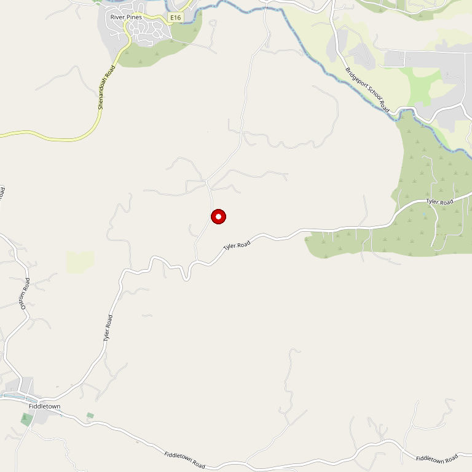

# Dillian Wines

> *Fourth-generation Amador farmer continuing his father's legacy*

## Location

## Overview

| Field | Value |
|-------|-------|
| **Location** | Plymouth, Amador County |
| **AVA** | California Shenandoah Valley |
| **Founded** | 2003 |
| **Owner** | Tom Dillian (4th generation) |
| **Family Since** | 1917 (great-grandfather Alessio Dal Porto) |
| **Style** | Family tradition |
| **Focus** | Zinfandel |
| **Dog Friendly** | Yes |
| **Picnic Area** | Yes |

## Contact

- **Address:** Plymouth area
- **Website:** https://www.dillianwines.com
- **Tasting Room:** Check website for hours

## Wines

### Estate Wines
- **Zinfandel** — Planted 1972
- Family tradition wines

## History

Tom Dillian is a **fourth-generation Amador County farmer**. His great-grandfather, Alessio Dal Porto, first purchased this land in **1917**.

Tom, his twin brother Bill, and older brother Jerry replanted the original vineyard in Zinfandel grapes in 1972. At a young age, Tom learned grape growing and winemaking while working for his father, Mike D'Agostini, at the historic D'Agostini Winery.

The home winemaking ventures became more and more successful over the years. In December 2003, the dream became reality as Dillian Wines opened its doors — continuing the legacy handed down from his father.

## Notes

Deep Amador roots — from 1917 land purchase to 1972 Zinfandel planting to 2003 winery opening. This is generational winemaking.

### D'Agostini Connection
Tom's stepfather was **Mike D'Agostini** of the historic D'Agostini Winery (now Sobon Estate). Tom learned grape growing and winemaking at a young age working at that legendary property.

**Try Tre Fratelli Zinfandel** — made from those original 1972 vines planted by the three brothers. Also notable: Barbera with blackberry, vanilla, and anise notes, and Petite Sirah.

**TripAdvisor reviewer:** "No corporate stuffiness here — this is a family atmosphere where everyone feels at home. The staff is amazing, so friendly and inviting."

## Visited

- [ ] Have not visited

## Rating

*Not yet rated*

---

*Last updated: 2026-03-21*
