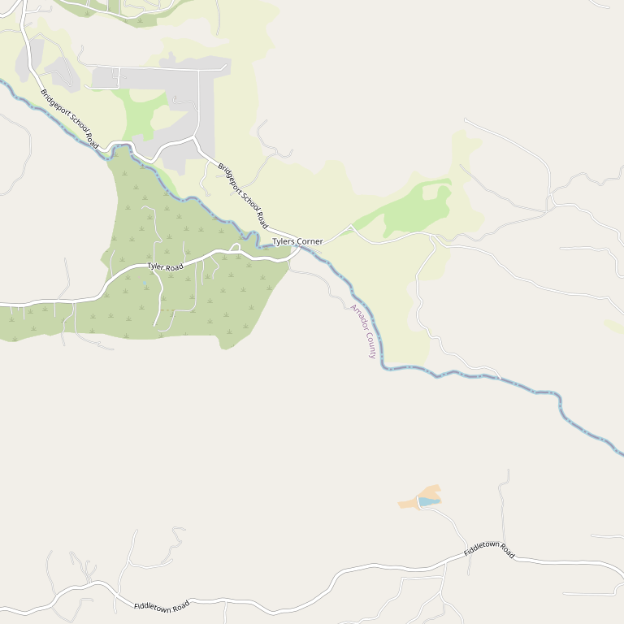

# Dobra Zemlja Winery

> *"Big Amador Reds, No Lightweights" — First wine cave in the county*

## Location

## Overview

| Field | Value |
|-------|-------|
| **Location** | Plymouth, Amador County |
| **AVA** | California Shenandoah Valley |
| **Style** | Big, hearty, unfiltered |
| **Focus** | Bold reds |
| **Wine Cave** | Yes — Amador County's first |
| **Dog Friendly** | Yes |
| **Picnic Area** | Yes |

## Contact

- **Address:** 12505 Steiner Road, Plymouth, CA 95669
- **Phone:** (209) 245-3183
- **Website:** https://www.dobraz.com
- **Tasting Room:** Thursday–Monday

## Wines

### Reds
- Big, hearty reds
- Unfiltered wines
- Bold Amador character

## Signature Wines

The motto says it all: **"Big Amador Reds, No Lightweights."** If you're looking for bold, hearty, unfiltered wines, Dobra Zemlja delivers.

## History

The name "Dobra Zemlja" means "good earth" in Croatian (pronounced Doh-bra Zem-ya). The winery features **Amador County's first wine cave** — a unique tasting experience.

## Notes

Pack a picnic lunch and come taste in Amador County's first wine cave. The welcoming atmosphere and bold wines make this a standout destination for those who appreciate big reds.

### Winemaking Philosophy
Founded in 1995 by **Milan and Victoria Matulich**, Dobra Zemlja produces hearty, **unfiltered and unfined wines using native yeast only**. The tasting room is literally dug into a hillside as a wine cave — the first in Amador County.

**Varietals:** Viognier, Zinfandel, and the bold reds this area is famous for.

The Croatian heritage (Milan's family roots) informs everything — "good earth" (dobra zemlja) isn't just a name, it's a philosophy of letting the land speak.

## Visited

- [ ] Have not visited

## Rating

*Not yet rated*

---

*Last updated: 2026-03-21*
