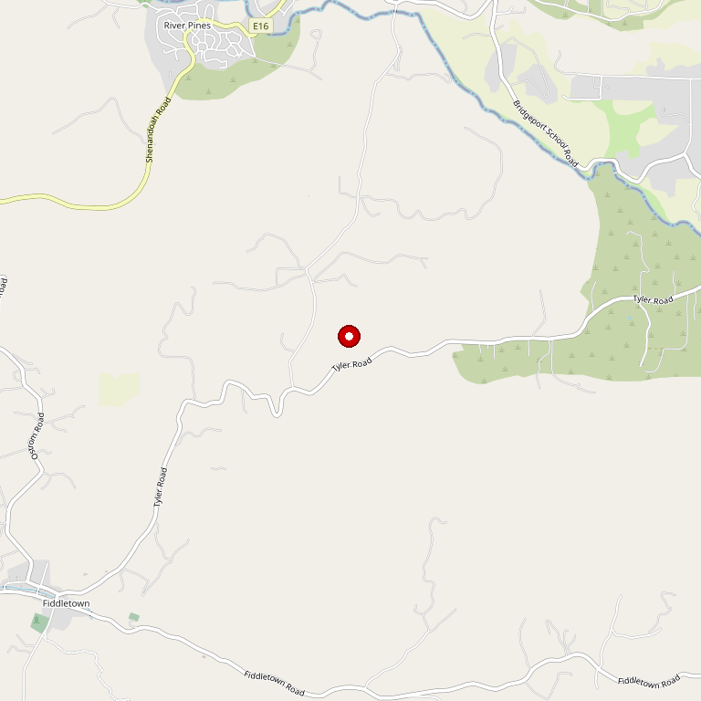

# Domenico Winery Amador

> *100-acre estate with 18-acre lake and new 5,100 sq ft tasting room*

## Location

## Overview

| Field | Value |
|-------|-------|
| **Location** | Plymouth, Amador County |
| **AVA** | California Shenandoah Valley |
| **Property** | 100 acres with 18-acre lake |
| **Style** | Estate, Italian varietals |
| **Focus** | Primitivo, Montepulciano, Aglianico, Nero d'Avola |
| **Tasting Room** | 5,100 sq ft (opened 2024) |
| **Weddings** | Yes |
| **Dog Friendly** | Yes |
| **Picnic Area** | Yes |

## Contact

- **Address:** Plymouth, CA
- **Website:** https://www.domenicoamador.com
- **Tasting Room:** Check website for hours

### Bay Area Location
- Domenico Winery + Osteria + Event Venue in San Carlos (since 2004)

## Wines

### Italian Varietals (Estate-Grown, Limited Production)
- **Primitivo**
- **Montepulciano**
- **Aglianico**
- **Nero d'Avola**
- **Syrah**
- **Cabernet Sauvignon**

## History

Domenico is a boutique, family-run winery taking pride in estate-grown, limited production varietals.

The brand-new 5,100 sq ft air-conditioned tasting room and event venue opened August 2024, blending comfortable farmhouse atmosphere with modern industrial touches.

## Notes

Nestled on 100 acres with stunning views of an 18-acre lake, Domenico is a picturesque hidden gem.

### Historic Landmark
The **J.H. Bonham Kiln** dates to 1859 — just five years after Amador became a California county. It was used to produce plaster and mortar from native limestone for constructing buildings in Sutter Creek and Jackson.

The new venue (opened August 2024) is actually 6,500 sq ft with 400-person capacity. The first floor features a farmhouse vibe with modern touches — stone, whitewashed wood, brass, a 9-ft fireplace, and Brazilian Quartzite counters.

Picnic baskets can be ordered in advance for lunch by the lake. Their Bay Area location in San Carlos has operated since 2004, featuring an Osteria (Italian restaurant) alongside the tasting room.

## Visited

- [ ] Have not visited

## Rating

*Not yet rated*

---

*Last updated: 2026-03-21*
