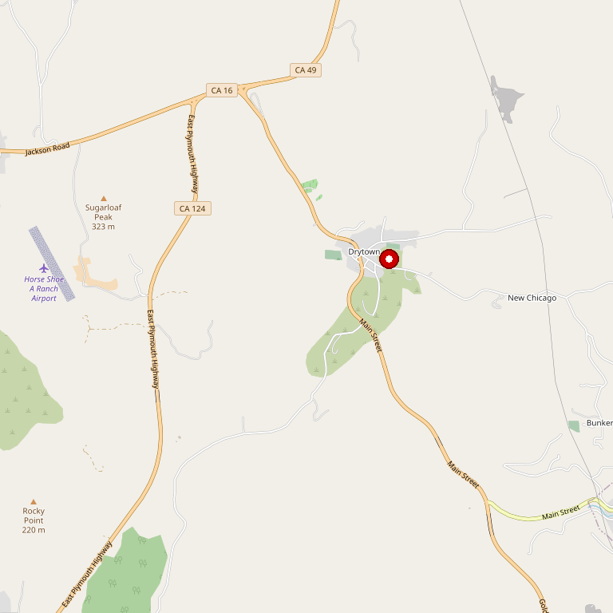

# Drytown Cellars

> *Estate vineyards in Drytown and El Dorado*

## Location

## Overview

| Field | Value |
|-------|-------|
| **Location** | Drytown, Amador County |
| **AVA** | Amador County / El Dorado |
| **Winemaker/Owner** | Allen Kreutzer |
| **Style** | Outstanding, balanced, intense |
| **Focus** | Estate and local fruit |
| **Dog Friendly** | Yes |
| **Picnic Area** | Yes |

## Contact

- **Address:** Highway 49, Drytown (between Plymouth and Sutter Creek)
- **Phone:** (209) 245-6899
- **Website:** https://www.drytowncellars.com
- **Tasting Room:** Daily

## Wines

### Estate Wines
- Estate vineyards in Drytown
- El Dorado County fruit
- Local growers' fruit

## Winemaking Philosophy

Winemaker/Owner Allen Kreutzer is dedicated to producing outstanding wines — well balanced and intensely flavored.

## History

Located on California's Historic Highway 49, between Plymouth and Sutter Creek, Drytown Cellars sits in the heart of Amador County.

## Notes

Taste wines in the Production House or outside overlooking the bucolic view of the Sierra Foothills. The location on Historic Highway 49 makes this an easy stop while exploring Gold Country.

**Lonely Planet pick:** "One of the most fun tasting rooms in Amador County, thanks to vintner Allen Kreutzer, a gregarious host, and his array of big reds."

**Specialties:** Zesty Zinfandels, bold Barberas, smooth Syrahs, and savory Sauvignon Blancs. Down-to-earth vibe compared to fancier Shenandoah Valley wineries — this is real, unpretentious wine country.

The winery and tasting room blend into a century-old ranch homestead. At times there's no tasting fee — call ahead.

## Visited

- [ ] Have not visited

## Rating

*Not yet rated*

---

*Last updated: 2026-03-21*
