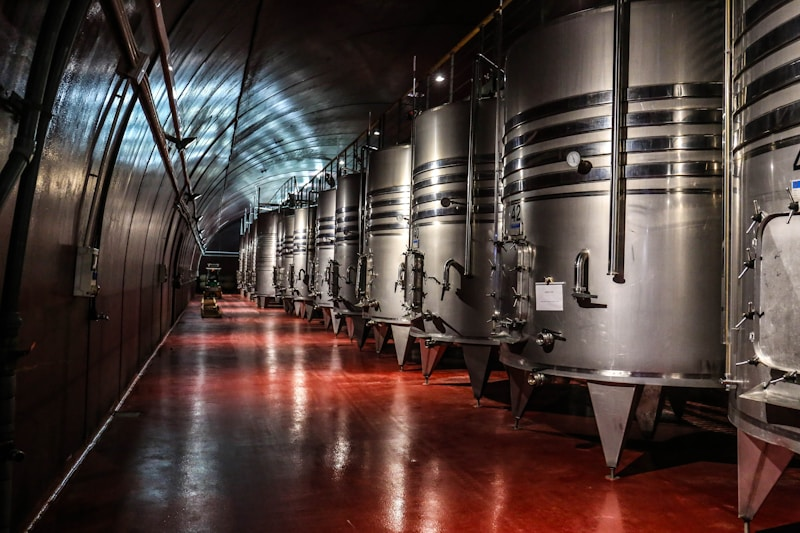
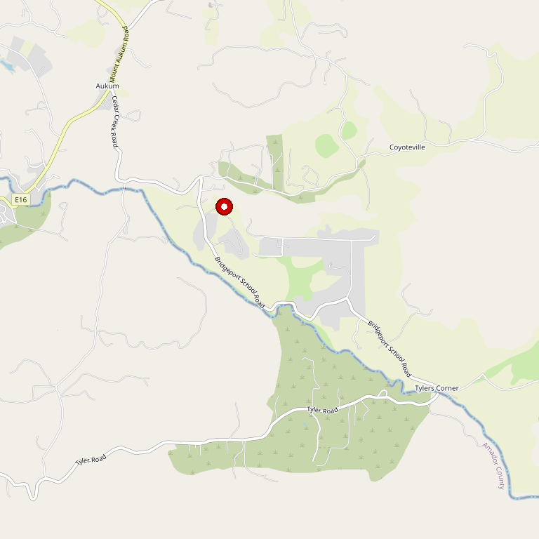

# Helwig Vineyards & Winery

> *Sweeping Sierra views, wine cave, and full kitchen*

## Location

## Overview

| Field | Value |
|-------|-------|
| **Location** | Plymouth, Amador County |
| **AVA** | California Shenandoah Valley |
| **Style** | Destination winery, diverse portfolio |
| **Focus** | Award-winning wines, events |
| **Restaurant** | Yes — Kitchen serves lunch Thu–Mon |
| **Wine Cave** | Yes |
| **Dog Friendly** | Yes |
| **Picnic Area** | Yes |
| **Weddings** | Yes |

## Contact

- **Address:** 11555 Shenandoah Road, Plymouth, CA 95669
- **Phone:** (209) 245-5200
- **Website:** https://www.helwigwinery.com
- **Tasting Room:** Thursday–Monday
- **Kitchen:** Lunch service Thu–Mon

## Wines

### Award-Winning Portfolio
- Diverse red and white varietals

## Facilities

- **Spacious tasting room**
- **"Cool" wine cave**
- **Meeting/conference rooms**
- **Terraced concert amphitheater**
- **Covered Pavilion**

## History

Helwig has built a reputation as one of Amador's premier destination wineries, offering something for everyone regardless of weather, event, or mood.

## Notes

The sweeping vistas overlooking lush vineyards, breathtaking views of the Sierra and Coastal mountains, and expansive sky make this worth an extended visit.

The Kitchen serves lunch Thursday through Monday — pair a meal with award-winning wines for the full experience.

### Recent Awards (2024 CA State Fair)
All 14 wines entered earned medals:
- **2024 MRV:** 99 points, Double Gold, Best of Region (White)
- **2020 Barbera Cooper Ranch:** 99 points, Double Gold

### Helwig LIVE Concert Series
The terraced amphitheater hosts major concerts throughout summer — past acts include Orleans, The Babys, and Peter Beckett (Player). Get tickets early; shows sell out.

**Note:** Facility is **21+ only** (including infants and toddlers). Plan accordingly.

## Visited

- [ ] Have not visited

## Rating

*Not yet rated*

---

*Last updated: 2026-03-21*
