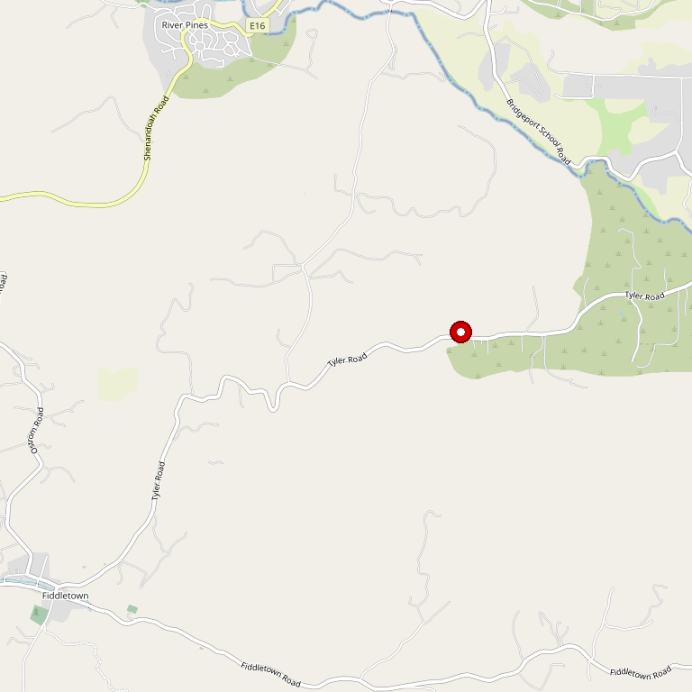

# Jeff Runquist Wines

> *Balanced wines with zest and vibrant flavors*

## Location

## Overview

| Field | Value |
|-------|-------|
| **Location** | Plymouth, Amador County |
| **AVA** | California Shenandoah Valley |
| **Winemaker** | Jeff Runquist |
| **Style** | Balanced, fresh fruit forward |
| **Focus** | Age-worthy wines without harsh tannins |
| **Dog Friendly** | Yes |
| **Picnic Area** | Yes |

## Contact

- **Address:** 10776 Shenandoah Road, Plymouth, CA 95669
- **Phone:** (209) 245-6282
- **Website:** https://www.jeffrunquistwines.com
- **Tasting Room:** Daily

## Wines

### Reds
- Multiple varietal wines
- Fresh fruit reflective of grape character
- Balanced without astringent tannins

### Whites
- Zesty, vibrant whites

## Winemaking Philosophy

Jeff Runquist produces balanced wines that can be enjoyed in their youth but will also age and become more complex with time. His wines share a theme of **fresh fruit reflective of the varietal flavors** inherent in the grape.

Jeff selects grapes from vineyards that provide rich, full flavors without loads of astringent tannins. He prefers wines with **zest and vibrant flavors**.

## History

As Jeff says: "Once I release a new vintage I rarely return to the previous year's wine. My father likes that; it means more of the older wines for him."

## Notes

This is winemaking with a clear point of view — if you appreciate approachable yet age-worthy wines with true varietal character, Jeff Runquist delivers.

### An "Overnight Success" 37+ Years in the Making
Jeff began in 1977 as an intern with Paul Masson while studying enology at UC Davis. After graduating, he worked at Montevina in Amador County and was promoted to winemaker in 1982.

After stints at Napa Valley Cooperative Winery (1987-1990) and J. Lohr in San Jose, it became clear he needed to make wine his own way. Now known for "unique varietals from California's premier appellations" — for adventurous wine drinkers looking to explore the diversity of the wine world.

## Visited

- [ ] Have not visited

## Rating

*Not yet rated*

---

*Last updated: 2026-03-21*
