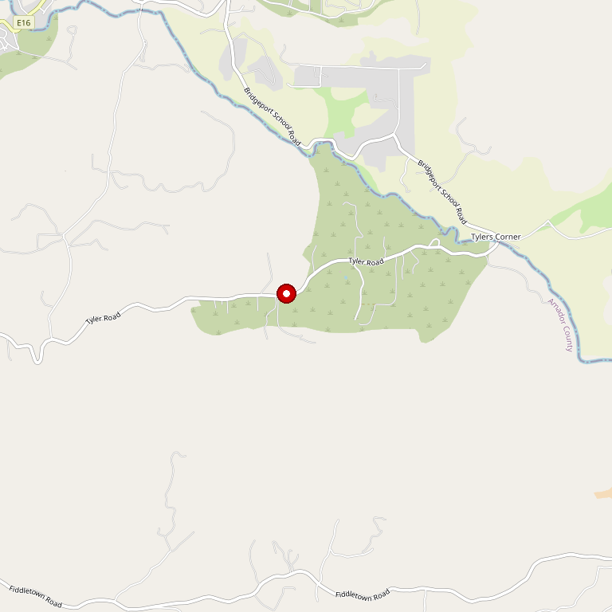

# Karmère Vineyards & Winery

> *French-style château in the Shenandoah Valley*

## Location

## Overview

| Field | Value |
|-------|-------|
| **Location** | Plymouth, Amador County |
| **AVA** | California Shenandoah Valley |
| **Style** | French-inspired |
| **Focus** | Current releases and barrel tastings |
| **Dog Friendly** | Yes |
| **Picnic Area** | Yes |

## Contact

- **Address:** 11970 Shenandoah Road, Plymouth, CA 95669
- **Phone:** (209) 245-5600
- **Website:** https://www.karmere.com
- **Tasting Room:** Daily

## Wines

### Current Releases
- Multiple varietals

### Barrel Tastings
- Future releases available for tasting

## History

Karmère Vineyards and Winery is located in the majestic Shenandoah Valley. The beautiful French-style château tasting room creates a European-inspired experience.

## Notes

Taste current popular releases as well as future releases straight from the barrel — a rare opportunity to preview wines before release.

**Architecture standout:** The château is an Instagram favorite — TripAdvisor reviewers note it "evokes the look of an old French château" with beautiful gardens and grounds.

Rooted in farming heritage and deep love for the land. The tasting room staff are consistently praised for their warmth and knowledge.

Reservations required for groups of 10+.

## Visited

- [ ] Have not visited

## Rating

*Not yet rated*

---

*Last updated: 2026-03-21*
