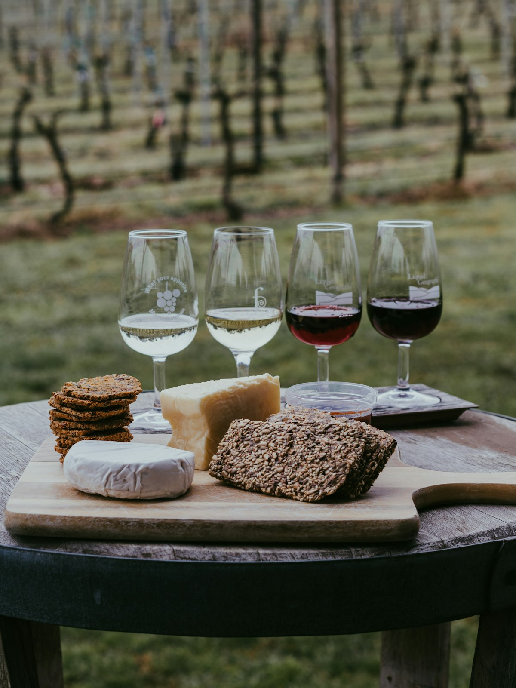
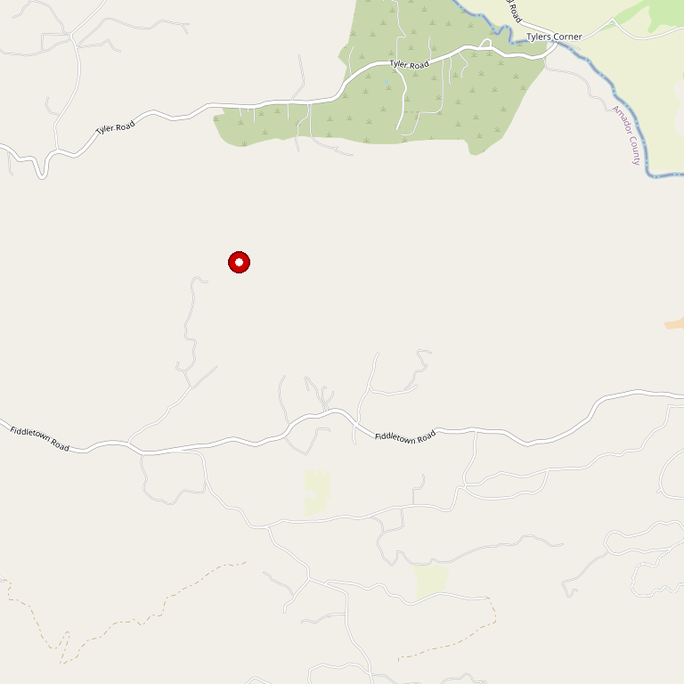

# Linsteadt Family Winery

> *"Come as a friend, leave as family"*

## Location

## Overview

| Field | Value |
|-------|-------|
| **Location** | Plymouth, Amador County |
| **AVA** | California Shenandoah Valley |
| **Generations** | Three generations of grape growing |
| **Style** | Family, estate-focused |
| **Focus** | Barbera (flagship), Petite Sirah, Grenache |
| **Dog Friendly** | Yes |
| **Picnic Area** | Yes |

## Contact

- **Address:** 23200 Upton Road, Plymouth, CA 95669
- **Phone:** (209) 660-3731
- **Website:** https://www.linsteadtwinery.com
- **Tasting Room:** Saturday & Sunday 11am–4pm

## Wines

### Reds
- **Barbera** — Flagship grape
- **Petite Sirah** — Gold medal winner
- **Grenache** — Wine Club favorite

## History

For three generations, Linsteadt Vineyards has consistently grown the highest quality grapes. Now for the first time, they are producing wines under the Linsteadt Family Winery label.

## Notes

The Linsteadt motto: **"Come as a friend, leave as family, and see why you should drink Linsteadt instead."**

### Family-Owned, Limited Production
Three generations of growing the highest quality grapes, now finally bottling under their own label. Located in the Shenandoah Valley AVA.

**Try the blend:** Estate red wine of Zinfandel and Barbera — "juicy and full with a range of stonefruit sweetness, balanced by just enough tart cherry to keep the finish crisp." Wine description: "In a Song: Nuthin but A 'G' Thang" — this winery has personality.

**Hours:** Saturday & Sunday 11am-4pm. **Address:** 23200 Upton Road, Plymouth

## Visited

- [ ] Have not visited

## Rating

*Not yet rated*

---

*Last updated: 2026-03-21*
