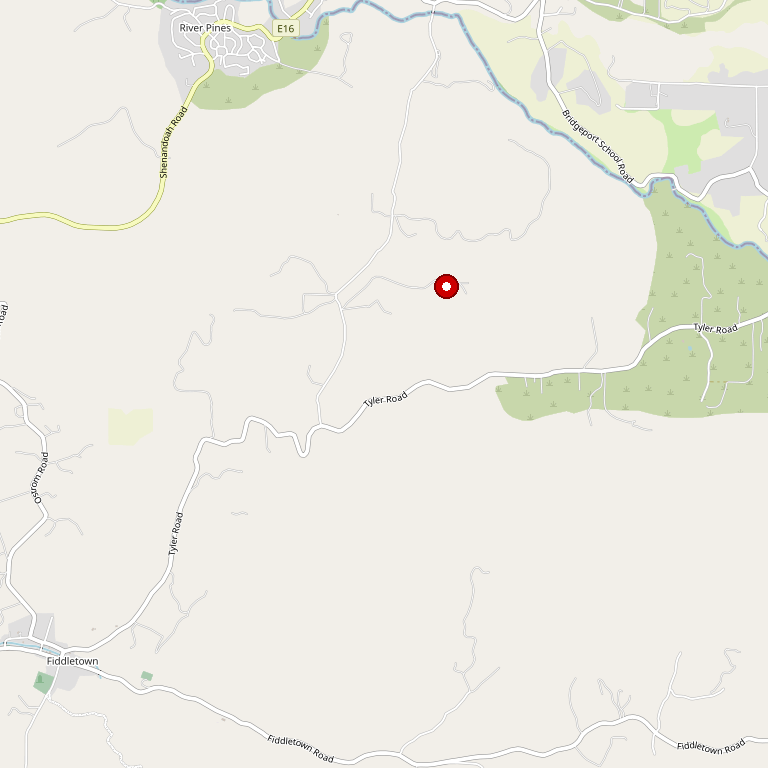

# Rombauer Vineyards (Amador Tasting Room)

> *Legendary Napa producer's Sierra Foothills outpost*

## Location

## Overview

| Field | Value |
|-------|-------|
| **Location** | Plymouth, Amador County |
| **AVA** | California Shenandoah Valley |
| **Parent** | Rombauer Vineyards (Napa Valley) |
| **Style** | Premium, locally-sourced |
| **Focus** | Zinfandel, Barbera, Rombauer portfolio |
| **Dog Friendly** | Yes |
| **Picnic Area** | Yes (shaded patio, lawn) |

## Contact

- **Address:** 11590 Shenandoah Road, Plymouth, CA 95669
- **Phone:** Check website
- **Website:** https://rombauer.com
- **Tasting Room:** Thursday–Monday

## Wines

### Local Sourcing
- **Zinfandel** — Locally sourced
- **Barbera** — Locally sourced

### Full Rombauer Portfolio
- All Rombauer wines available by taste, glass, or bottle

## History

Experience the tranquil beauty of the Sierra Foothills wine growing region at Rombauer's Tasting Room in Plymouth, in the heart of Amador County.

## Notes

Surrounded by lush landscaping, the Tasting Room features spacious indoor and outdoor spaces including a tasting bar, shaded patio, and lawn.

This is a rare opportunity to taste the full Rombauer portfolio alongside locally-sourced Sierra Foothills wines in a beautiful setting.

### What's Available
- **Chardonnay** — Their iconic, buttery Chardonnay that made them famous
- **Semillon**
- **Barbera** — Locally sourced Sierra Foothills fruit
- **Old Vine Zinfandel** — Local fruit
- Red blends and spirits distilled from their wines

**Experiences:** Educational tours of the Plymouth winery followed by seated Wine and Cheese Pairings. Tours start in the display vineyard, learning how they grow their grapes.

Pet and family-friendly with expansive outdoor picnic space.

## Visited

- [ ] Have not visited

## Rating

*Not yet rated*

---

*Last updated: 2026-03-21*
