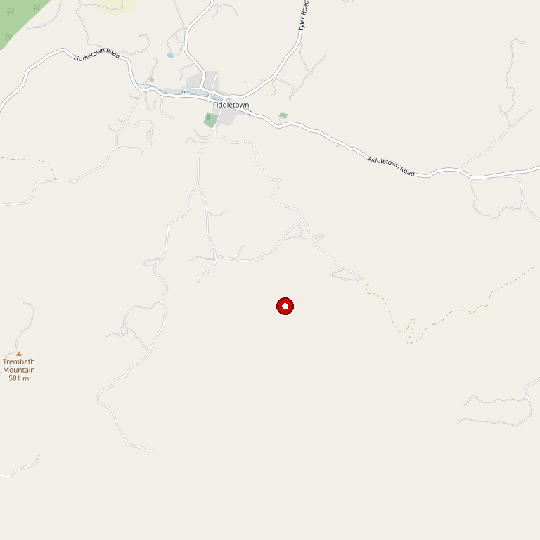

# Scott Harvey Wines

> *40+ years of Amador winemaking with European training*

## Location

## Overview

| Field | Value |
|-------|-------|
| **Location** | Plymouth & Sutter Creek, Amador County |
| **AVA** | California Shenandoah Valley |
| **Winemaker** | Scott Harvey |
| **Experience** | 40+ years in Amador |
| **Style** | Elegant, approachable, European-influenced |
| **Focus** | Single varietals and blends |
| **Dog Friendly** | Yes |
| **Picnic Area** | Yes |

## Contact

- **Locations:** Two tasting rooms in Amador County
- **Website:** https://www.scottharveywines.com
- **Tasting Room:** Check website for hours

## Wines

### Estate Wines
- Elegant single varietal wines
- Inviting blends

## Winemaking Philosophy

Scott Harvey's European training allows him to make elegant and approachable single varietal wines and inviting blends that "talk to you, telling their story of place, vintage, and variety."

## History

Scott Harvey has produced wine from Amador County for more than **40 years**, making him one of the region's most experienced and respected winemakers. His deep knowledge of local terroir combined with European techniques creates distinctive wines.

## Notes

With two tasting room locations in Amador County, visitors have options for experiencing Scott Harvey's portfolio. The winery offers an exceptional tasting experience for both newcomers and wine enthusiasts.

## Visited

- [ ] Have not visited

## Rating

*Not yet rated*

---

*Last updated: 2026-03-21*
