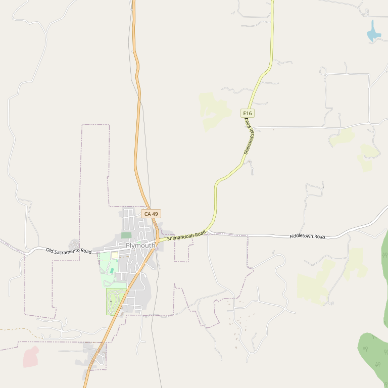

# Shenandoah Vineyards

> *Quality wines at affordable pricing since 1977*

## Location

## Overview

| Field | Value |
|-------|-------|
| **Location** | Plymouth, Amador County |
| **AVA** | California Shenandoah Valley |
| **Founded** | 1977 |
| **Founders** | The Sobon Family |
| **Style** | Quality, affordable |
| **Focus** | Diverse varietals |
| **Dog Friendly** | Yes |
| **Picnic Area** | Yes — breathtaking views |

## Contact

- **Address:** Shenandoah Road, Plymouth, CA
- **Website:** https://sobonwine.com
- **Tasting Room:** Check website for hours

## Wines

### Estate Wines
- Diverse portfolio
- Quality at affordable pricing

## History

Shenandoah Vineyards was established in 1977 by the Sobon family with the goal of making the finest wines possible at affordable pricing. This sister property to Sobon Estate carries forward the family's commitment to quality.

## Notes

The tasting room features knowledgeable, friendly staff and an **art gallery** with contemporary art and ceramics.

The picnic area offers breathtaking views of the surrounding vineyards — perfect for an afternoon with a bottle.

**Location advantage:** Closer to Plymouth than sister property Sobon Estate, sitting atop a hill surrounded by sloping vineyards with impressive valley views. The art gallery is a main draw for many visitors.

### Technical Excellence
- Majority estate-grown and sustainably farmed
- Choice micro-climates and soils with carefully selected clones
- **Highest elevations in the Shenandoah Valley**
- State-of-the-art winemaking with 60+ years combined expertise

## Visited

- [ ] Have not visited

## Rating

*Not yet rated*

---

*Last updated: 2026-03-21*
