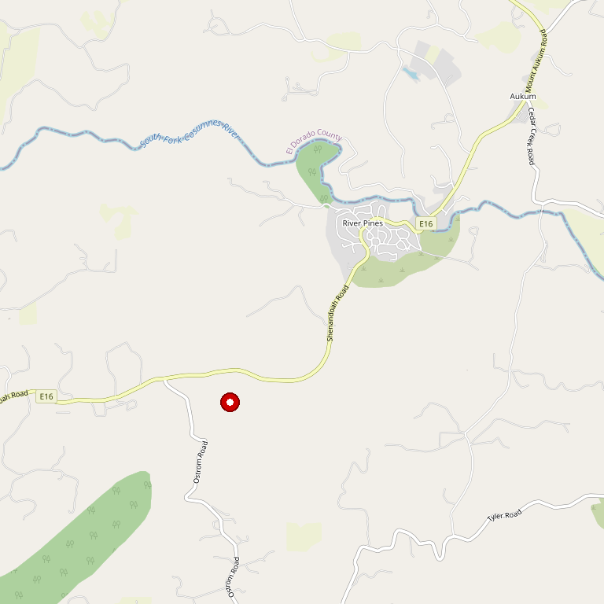

# Sobon Estate

> *Founded 1856 — Among California's oldest wineries*

## Location

## Overview

| Field | Value |
|-------|-------|
| **Location** | Plymouth, Amador County |
| **AVA** | California Shenandoah Valley |
| **Founded** | 1856 |
| **Style** | Historic, traditional |
| **Focus** | Zinfandel, diverse reds and whites |
| **Historic Status** | California Registered Landmark |
| **Dog Friendly** | Yes |
| **Picnic Area** | Yes |

## Contact

- **Address:** 14430 Shenandoah Road, Plymouth, CA 95669
- **Phone:** (209) 245-4455
- **Website:** https://sobonwine.com
- **Tasting Room:** Daily 9:30am–5pm

## Wines

### Reds
- **Cougar Hill Zinfandel** — Menthol atop huge blackberry jam
- **Old Vine Zinfandel** (Fiddletown) — Stone fruit with cinnamon and nutmeg
- Various estate reds

### Whites
- Rich white varietals

## Signature Wines

**Cougar Hill Zinfandel** — Delivers a hit of menthol atop huge blackberry jam flavor.

**Old Vine Zin (Fiddletown)** — Massive stone fruit tastes tango with spicy notes of cinnamon and nutmeg.

## History

Founded in **1856**, Sobon Estate is among the oldest wineries in California and a California Registered Landmark. A visit features both fantastic wine sampling and time travel to Amador County's gloried wine history.

The site hosts the **Shenandoah Valley Museum** of early agriculture and winemaking, making this essential visiting for wine history enthusiasts.

The Sobon Family is dedicated to making wines that express the true character of the Sierra Foothills.

## Notes

The historic D'Agostini Winery property offers an experience beyond wine tasting — visitors can explore the museum and connect with California's earliest wine heritage.

## Visited

- [ ] Have not visited

## Rating

*Not yet rated*

---

*Last updated: 2026-03-21*
