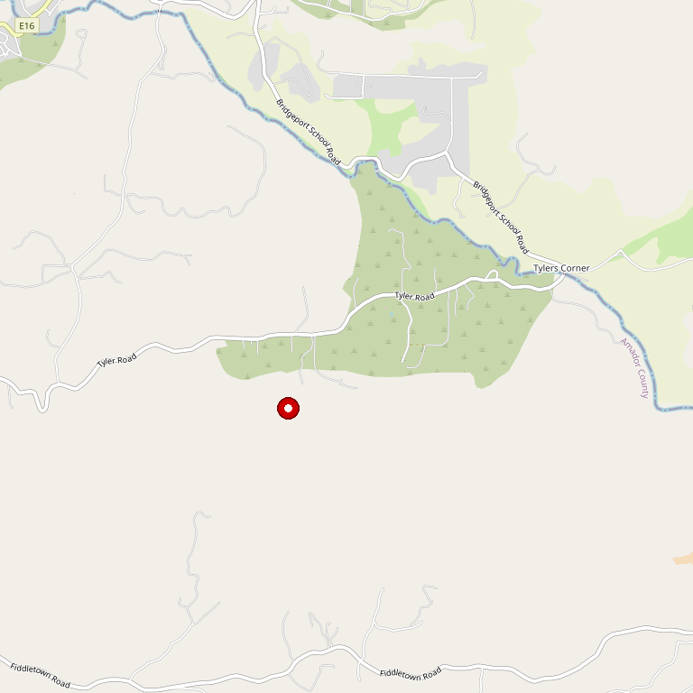

# Tanis Vineyards

> *Primitivo, Pinotage, Barbera and "we have chocolates!"*

## Location

## Overview

| Field | Value |
|-------|-------|
| **Location** | Plymouth, Amador County |
| **AVA** | California Shenandoah Valley |
| **Style** | Intense, concentrated, balanced |
| **Focus** | Primitivo, Pinotage, Barbera, Sangiovese |
| **Dog Friendly** | Yes |
| **Picnic Area** | Yes |

## Contact

- **Address:** 13120 Willow Creek Road, Plymouth, CA 95669
- **Phone:** (209) 245-3325
- **Website:** http://www.tanisvineyards.com
- **Tasting Room:** Friday–Sunday

## Wines

### Reds
- **Primitivo** — Rich and intense
- **Pinotage** — Rare South African varietal
- **Barbera**
- **Sangiovese**
- Additional varietals

### Whites
- Crisp white wines

### Sparkling
- Bubbly offerings

## Winemaking Philosophy

Lovingly-tended vines ensure optimum quality of limited production varietals. Unique techniques emphasize intensity, concentration, and balance, bringing authentic expression to the wines.

## Notes

Come enjoy wines and stimulating conversation. And if you're not on your way yet... **"we have chocolates!"**

The rare Pinotage varietal makes this a unique destination for wine adventurers.

## Visited

- [ ] Have not visited

## Rating

*Not yet rated*

---

*Last updated: 2026-03-21*
