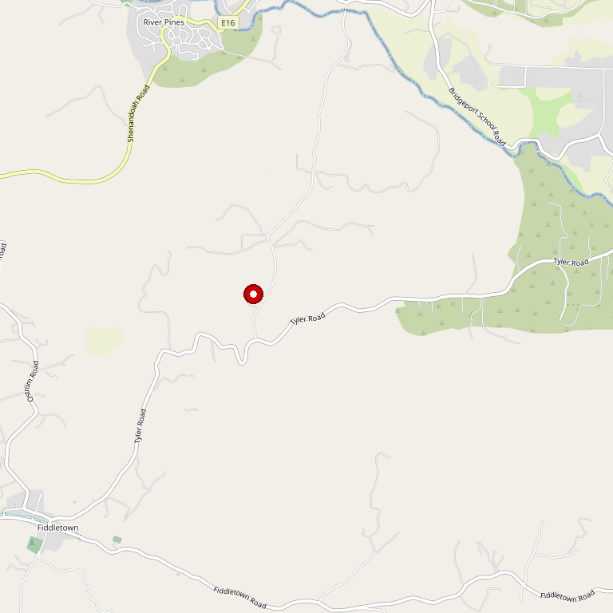

# Terre Rouge & Easton Wines

> *Home of the Sierra Foothills' first 100-point wine*

## Location

## Overview

| Field | Value |
|-------|-------|
| **Location** | Plymouth, Amador County |
| **AVA** | California Shenandoah Valley / Fiddletown |
| **Founded** | 1994 |
| **Winemaker** | Bill Easton |
| **Style** | Artisan, Rhône-focused (Terre Rouge) / Zinfandel, Barbera (Easton) |
| **Focus** | Rhône varietals, Old Vine Zinfandel |
| **Dog Friendly** | Yes |
| **Picnic Area** | Yes |

## Contact

- **Address:** Off Shenandoah Road, Plymouth, CA
- **Phone:** (209) 245-4277
- **Website:** https://www.terrerougewines.com
- **Tasting Room:** By appointment — seated tasting experience

## Wines

### Terre Rouge (Rhône Focus)
- **Syrah** — Multiple vineyard designates
- **Grenache**
- **Mourvèdre**
- **Viognier**
- Rhône blends

### Easton Portfolio
- **Old Vine Zinfandel** — Single vineyard
- **Barbera**
- Additional varietals

## Signature Wines

**100-Point Wine** — Terre Rouge produced the first 100-point wine in the Sierra Foothills, establishing the region's potential for world-class quality.

## History

Bill Easton founded the winery in 1994 with two distinct labels:
- **Terre Rouge** — Concentrates on Rhône varietals
- **Easton** — Features single vineyard Old Vine Zinfandel, Barbera, and more

The first 100-point wine in the Sierra Foothills brought national renown to both the winery and the region.

## Notes

This is a **nationally renowned winery** described as "a hidden gem right off Shenandoah Road."

Tastings are seated experiences, allowing visitors to explore the artisan wines of the Sierra Foothills in depth. Reservations required.

### The 100-Point Wine: Ascent Syrah
**Terre Rouge 2016 Ascent Syrah** received a perfect 100 points from Wine Enthusiast — "a grand, ageworthy wine from consistently stellar winemaker Bill Easton." This put the Sierra Foothills on the map as a world-class wine region.

**Ascent is Bill's pet project** — his pursuit of the best Syrah ever. The criteria is so stringent that Ascent isn't even released annually. Aged 23+ months in French oak, Rhône-style.

**Founded in the late '80s** by husband-wife team Bill Easton and Jane O'Riordan. Bill is considered one of California's most important Rhône-style winemakers.

## Visited

- [ ] Have not visited

## Rating

*Not yet rated*

---

*Last updated: 2026-03-21*
