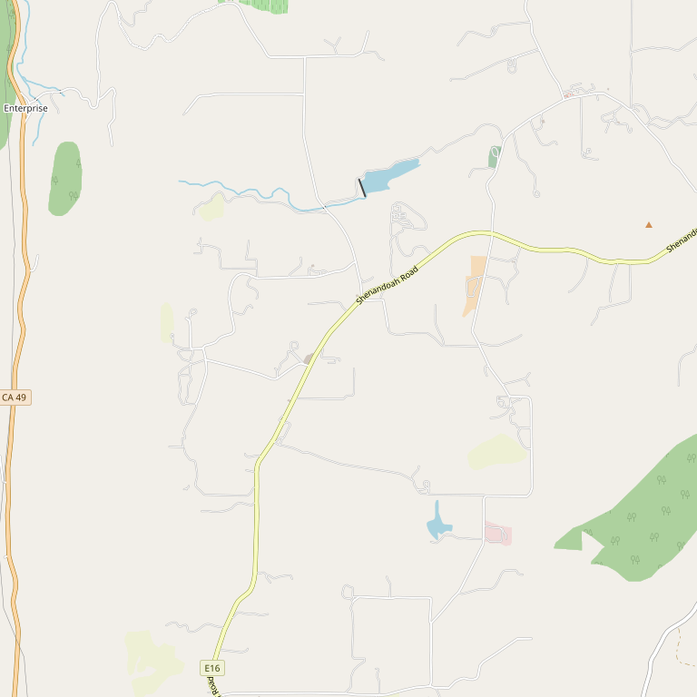

# TKC Vineyards

> *Premium wines since 1981*

## Location

## Overview

| Field | Value |
|-------|-------|
| **Location** | Plymouth, Amador County |
| **AVA** | California Shenandoah Valley |
| **Founded** | 1981 |
| **Style** | Premium, small family |
| **Focus** | Zinfandel, Mourvèdre, Syrah, Port |
| **Dog Friendly** | Yes |
| **Picnic Area** | Yes |

## Contact

- **Address:** 11001 Valley Drive, Plymouth, CA 95669
- **Phone:** (209) 245-6428
- **Website:** http://tkcvineyards.com
- **Tasting Room:** Friday–Sunday

## Wines

### Reds
- **Zinfandel** — House specialty
- **Mourvèdre**
- **Cabernet Sauvignon**
- **Syrah**

### Port
- Traditional port-style wines

### Blends
- "Some wonderful blends"

## History

Established in 1981, TKC Vineyards is a small family winery committed to the production of premium wines.

## Notes

Specialties of the house include Zinfandel, Mourvèdre, Cabernet Sauvignon, Syrah, Port, and some wonderful blends.

### The Name
**TKC** stands for the founders' three children: **Tierre, Karina, and C**... — a family name for a family winery.

**Origin story:** They built the winery in 1981 and made their first commercial Zinfandel vintage while still keeping day jobs — commuting 460 miles one way each month to work at the winery. "Vacation, they called it."

### Planting Timeline
- **1981:** Zinfandel (flagship, still going strong)
- **1993:** Mourvèdre
- **1997:** Cabernet Sauvignon (clone 7)
- **2000:** Syrah Noir

**Try:** The Syrah Port — boutique production from Syrah Noir.

## Visited

- [ ] Have not visited

## Rating

*Not yet rated*

---

*Last updated: 2026-03-21*
