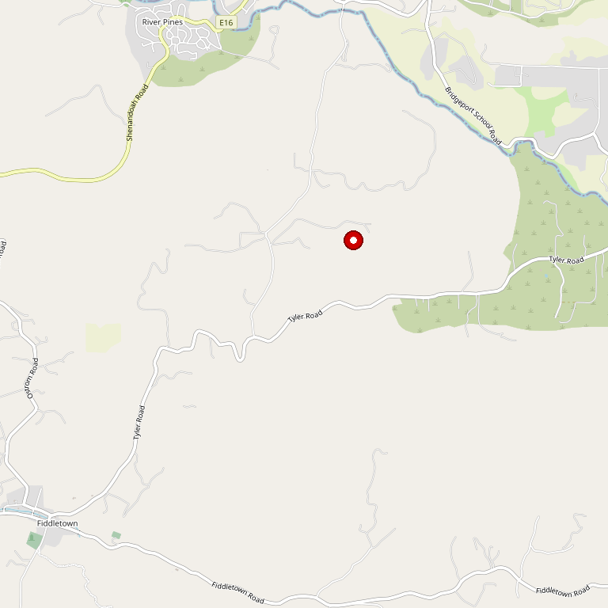

# Villa Toscano

> *Romantic winery with gardens and tranquil ponds*

## Location

## Overview

| Field | Value |
|-------|-------|
| **Location** | Plymouth, Amador County |
| **AVA** | California Shenandoah Valley |
| **Owners** | Erika and Jerry Wright |
| **Style** | Romantic, Italian-inspired |
| **Focus** | Estate wines |
| **Dog Friendly** | Yes |
| **Picnic Area** | Yes |
| **Weddings** | Yes |

## Contact

- **Address:** 10600 Shenandoah Road, Plymouth, CA 95669
- **Phone:** (209) 245-3800
- **Website:** https://www.villatoscano.com
- **Tasting Room:** Daily

## Wines

### Estate Wines
- Diverse red and white portfolio

## History

Erika and Jerry Wright, owners of Villa Toscano, have always cherished this beautiful, historic wine-growing region.

## Notes

A leisurely afternoon is perfectly spent at this romantic winery, nestled among breathtaking gardens and tranquil ponds. Pairing a delicious lunch with a glass of wine creates a truly memorable experience.

## Visited

- [ ] Have not visited

## Rating

*Not yet rated*

---

*Last updated: 2026-03-21*
