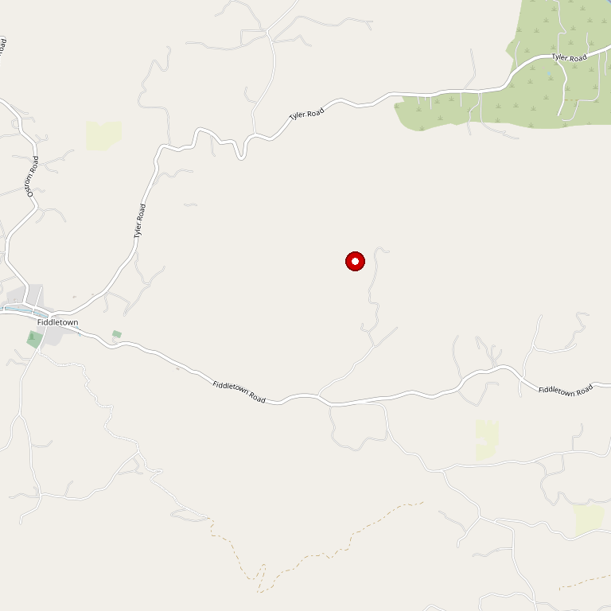

# Winetree Farm

> *Off-the-grid, animal-friendly, mom-and-son operation*

## Location

## Overview

| Field | Value |
|-------|-------|
| **Location** | Plymouth, Amador County |
| **AVA** | Amador County |
| **Owners** | Mom "Corinne" and Son "Nic" |
| **Style** | Off-the-grid, sustainable |
| **Focus** | Minimal intervention wines |
| **Farming** | Sustainable, sheep for grass control |
| **Dog Friendly** | Yes — "Bring your people-friendly animals" |
| **Picnic Area** | Yes |

## Contact

- **Address:** Plymouth area
- **Website:** https://www.winetreefarm.com
- **Tasting Room:** Check website for hours

## Wines

### Sustainable Wines
- Minimal chemical intervention
- Estate-grown

## Farming Philosophy

Off-the-grid, non-pretentious, down-to-earth. The farm uses sustainable methods that minimize chemicals to necessities and practices good land and environmental stewardship.

Sheep are used to keep grasses under control (but not during growing season).

## History

Everything is done by Mom "Corinne" and Son "Nic" — a true family operation.

## Notes

Visitors are encouraged to "bring your people-friendly animals" — this is one of the most welcoming and authentic farm experiences in Amador County.

**Rhône specialists** — the portfolio focuses on Syrah, Grenache, and Mourvèdre, with single varietals carrying the 'Corinne' brand named for mom.

**Best-kept secret:** Reviewers consistently note these are some of the most affordable wines in the Amador/Plymouth area without sacrificing quality. "Slightly out of the way but well worth the visit."

Also has a tasting room in downtown Amador City (Fri-Sun 12-5pm) for those who can't make it to the farm.

## Visited

- [ ] Have not visited

## Rating

*Not yet rated*

---

*Last updated: 2026-03-21*
