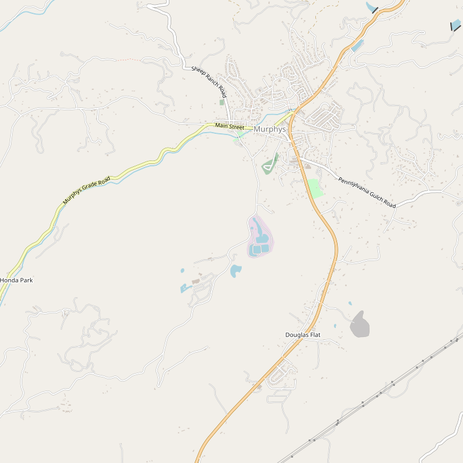

# Black Sheep Winery

> *40 years of distinctive small-batch wines since 1984*

## Location

## Overview

| Field | Value |
|-------|-------|
| **Location** | Murphys, Calaveras County |
| **AVA** | Calaveras County |
| **Founded** | 1984 |
| **Style** | Bold, unique, small-batch |
| **Focus** | Zinfandel, limited releases |
| **Dog Friendly** | Yes |
| **Picnic Area** | Yes |

## Contact

- **Address:** 276 Main Street, Murphys, CA 95247
- **Website:** https://blacksheepwinery.com
- **Tasting Room:** Daily 11am–5pm

## Wines

### Small-Batch Wines
- **Zinfandel** — Original flagship (1984 debut)
- Distinctive limited-release wines
- High-quality Calaveras and Amador grapes

## History

Black Sheep Winery began in **1984** with a bold Amador Zinfandel, setting itself apart with unique, small-batch wines from day one. Using high-quality grapes from Calaveras and Amador Counties, they've crafted distinctive, limited-release wines for 40 years.

## Notes

The name says it all — Black Sheep has always done things differently. If you're looking for something beyond mainstream wines, this 40-year veteran delivers.

### Founding Story
Founders **Janis and David Olson** crushed their first Zinfandel in 1984 with assistance from current owner/winemaker **Steve Millier**. The wine was styled "in a big, bold way like nobody else could do."

**Historic firsts:**
- **Third oldest tasting room in Calaveras County**
- **First in the area to make Rhône varietals**

**Try:** "True Frogs Lily Pad Red" — a special wine celebrating the famous Calaveras County Frog Jumps (Mark Twain connection!).

Housed in a charming **historic little yellow farmhouse** on Main Street. Wide variety: Chardonnay, Cinsault, Shiraz, Cabernet Sauvignon, Merlot, and Port-style dessert wine.

## Visited

- [ ] Have not visited

## Rating

*Not yet rated*

---

*Last updated: 2026-03-21*
