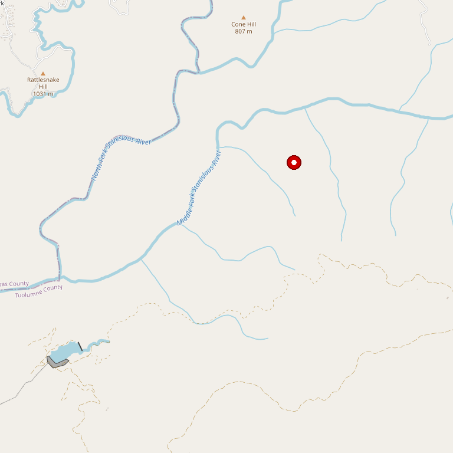

# Brice Station Vineyards

> *One of California's highest vineyards at 3,300 feet*

## Location

## Overview

| Field | Value |
|-------|-------|
| **Location** | Between Murphys & Arnold, Calaveras County |
| **AVA** | Calaveras County |
| **Elevation** | 3,300 ft |
| **Style** | High-altitude, estate |
| **Focus** | Estate wines |
| **Dog Friendly** | Yes |
| **Picnic Area** | Yes (hilltop views) |
| **Weddings** | Yes |

## Contact

- **Address:** 3353 E Highway 4, Murphys, CA 95247
- **Website:** https://bricestation.com
- **Tasting Room:** Friday–Sunday 12pm–6pm

## Wines

### Estate Wines
- High-altitude grown
- Extreme elevation character

## Facilities

- Dog-friendly tasting room
- Pottery studio and gallery
- Hilltop views
- Summer concerts
- Wedding and event venue
- Estate garden and farm
- Historical property

## History

At **3,300 feet**, Brice Station is one of the highest vineyards in California. The family-operated historical property offers much more than wine.

## Notes

The extreme elevation creates unique growing conditions rarely found in California viticulture.

## Visited

- [ ] Have not visited

## Rating

*Not yet rated*

---

*Last updated: 2026-03-21*
