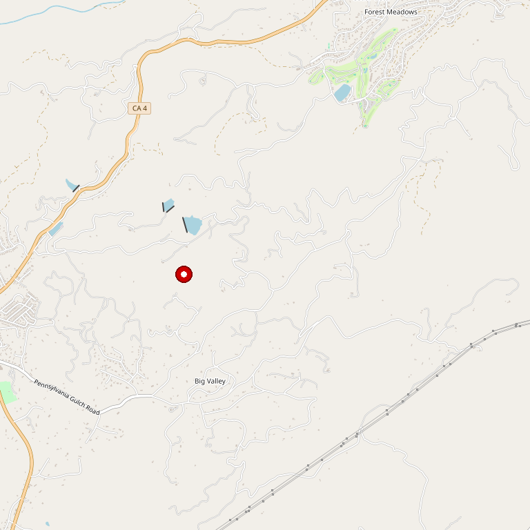

# Indian Rock Vineyards

> *Award-winning wines with serene pond — "don't forget to feed the fish!"*

## Location

## Overview

| Field | Value |
|-------|-------|
| **Location** | Murphys, Calaveras County |
| **AVA** | Calaveras County |
| **Style** | Rustic charm, award-winning |
| **Focus** | Estate wines |
| **Dog Friendly** | Yes |
| **Picnic Area** | Yes (by the pond) |

## Contact

- **Address:** 1154 Pennsylvania Gulch Road, Murphys, CA 95247
- **Website:** https://indianrockvineyards.com
- **Tasting Room:** Wednesday–Sunday 11am–5pm

## Wines

### Award-Winning Wines
- Estate varietals

## Notes

Escape to Indian Rock Vineyards just outside Murphys — where award-winning wines meet natural charm.

Sip in the rustic tasting room, unwind by the serene pond, and don't forget to feed the fish! Perfect for a peaceful afternoon picnic or memorable tasting experience.

## Visited

- [ ] Have not visited

## Rating

*Not yet rated*

---

*Last updated: 2026-03-21*
