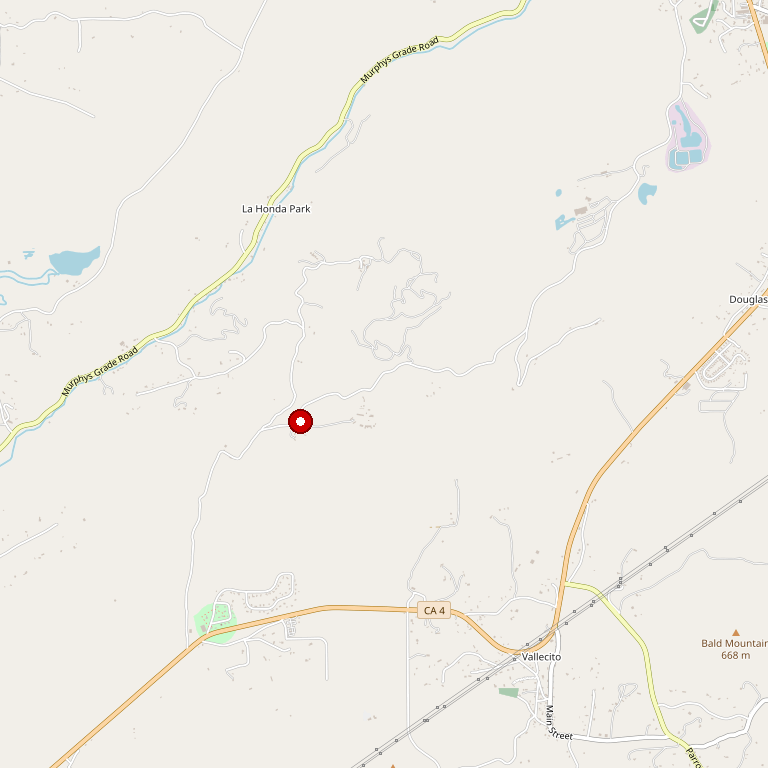

# Ironstone Vineyards

> *Premier destination with 44-pound gold nugget and summer concerts*

## Location

## Overview

| Field | Value |
|-------|-------|
| **Location** | Murphys, Calaveras County |
| **AVA** | Calaveras County |
| **Style** | Destination winery, diverse |
| **Focus** | Award-winning wines, events |
| **Restaurant** | Gold Leaf Deli |
| **Museum** | Heritage Museum (44-lb gold piece) |
| **Amphitheater** | Yes — Summer concert series |
| **Dog Friendly** | Yes |
| **Picnic Area** | Yes — Lakeside park |

## Contact

- **Address:** 1894 Six Mile Road, Murphys, CA 95247
- **Phone:** (209) 728-1251
- **Website:** https://ironstonevineyards.com
- **Tasting Room:** Thursday–Sunday 10am–5pm

## Wines

### Diverse Portfolio
- Estate varietals
- Award-winning wines

## Facilities

- Tasting Room
- Gold Leaf Deli
- Heritage Museum & Jewelry Shoppe
- **44-pound crystalline gold piece** — One of the largest gold specimens ever found
- Amphitheater with summer concert series
- Plush gardens and lakeside park
- Year-round events

## History

Ironstone Vineyards has become one of the premier destination wineries in the Sierra Foothills. The property combines winemaking with Gold Rush history and entertainment.

## Notes

This is more than a winery — it's a complete destination experience. The summer concert series at the amphitheater draws visitors from across California. The 44-pound crystalline gold piece in the museum is one of the largest ever found.

### The Kautz Family Legacy
In 1988, **John Kautz, his wife Gail, and their four children (Stephen, Kurt, Joan, and Jack)** built this winery and entertainment facility. Murphys is known as "The Queen of the Sierra."

### The Gold Nugget Story
**The Kautz specimen is the largest single piece of gold mined in North America since the 1880s** and the largest piece of crystallized gold in existence today. The French government wanted to buy it for the Louvre, but Kautz felt it belonged in California and purchased it. It was found only 9 air miles from the winery.

**Facilities:** Wine caves, 200,000 sq ft amphitheater, lakeside gardens, Heritage Museum, Gold Leaf Deli.

## Visited

- [ ] Have not visited

## Rating

*Not yet rated*

---

*Last updated: 2026-03-21*
