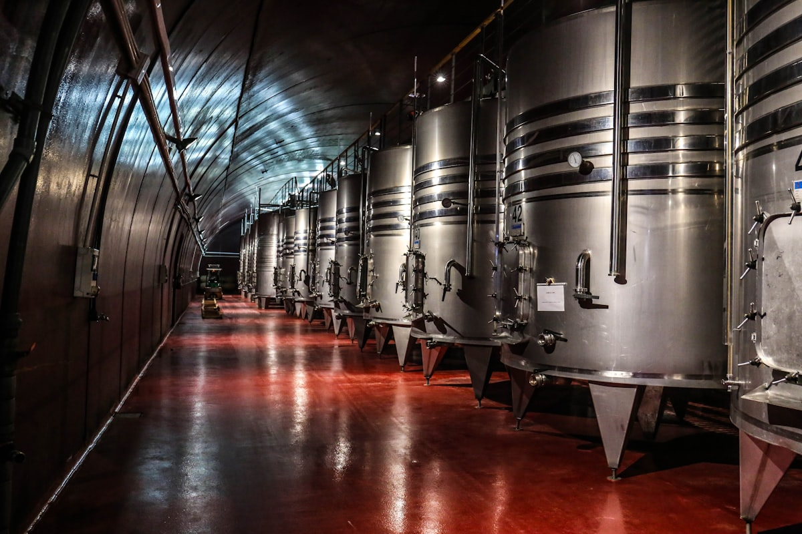

# La Folia Winery

> *Italian varietals "amid the madness" — hats welcome!*

## Location

## Overview

| Field | Value |
|-------|-------|
| **Location** | Murphys, Calaveras County |
| **AVA** | Calaveras County |
| **Style** | True Italian, traditional techniques |
| **Focus** | Italian varietals only |
| **Dog Friendly** | Yes |
| **Picnic Area** | Yes |

## Contact

- **Address:** 263A Main Street, Murphys, CA 95247
- **Website:** https://www.lafoliawines.com
- **Tasting Room:** Thursday 11am–5pm, Friday–Saturday 11am–6pm, Sunday 11am–5pm

## Wines

### Italian Varietals
- Only Italian grape varieties
- Traditional techniques
- Locally sourced

## Winemaking Philosophy

Amid "the madness," La Folia Winery crafts beautifully balanced wines in the **true Italian style**, using only Italian varietals and traditional techniques. Locally sourced wines earn consistent praise.

## Notes

A love for hats adds a playful twist — while not required, hats are welcome, and a variety are available in the tasting room. Here, you're encouraged to keep your hat on indoors!

### The Name
**"La Folia" means "The Madness"** — and they embrace it. Mad for delicious hand-crafted wines, fun hats, and entertaining events.

**One size doesn't fit all:** This winery is specifically for those who particularly like Italian wines. Their wine "The Madness" is a standout, and they offer opportunities to taste older vintages that age well.

**Reviewer favorite:** Hostess Shannon gets special mentions as "fabulous." The cozy ambiance and huge variety of wines make this a consistently praised stop.

## Visited

- [ ] Have not visited

## Rating

*Not yet rated*

---

*Last updated: 2026-03-21*
