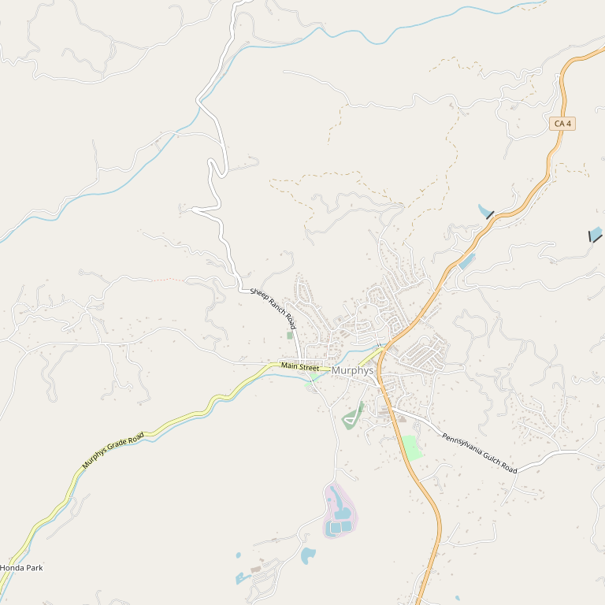

# Milliaire Winery

> *Amazing selection from Alicante to Zinfandel in refurbished gas station*

## Location

## Overview

| Field | Value |
|-------|-------|
| **Location** | Murphys, Calaveras County |
| **AVA** | Calaveras County |
| **Style** | Diverse Foothill wines |
| **Focus** | A to Z varietals |
| **Dog Friendly** | Yes |
| **Picnic Area** | Yes (patio by Murphys Creek) |

## Contact

- **Address:** 276 Main Street, Murphys, CA 95247
- **Website:** https://milliairewinery.com
- **Tasting Room:** Daily 11am–5pm

## Wines

### Wide Selection
- **Alicante** to **Zinfandel**
- Outstanding Foothill wines

## Notes

Taste an amazing selection of outstanding Foothill wines — everything from Alicante to Zinfandel — at this popular downtown Murphys location housed in a refurbished gas station.

Relax and enjoy a picnic on the patio alongside Murphys Creek.

### Origin Story
Founded by **Liz and Steve Millier in 1983** — in the cellar of their former home in Murphys! In 1990, they moved to an **old Flying A gas station** on Main Street.

**The early days:** Barrels stacked in the repair bays, wine tanks in the backyard, bottling in the front yard, and the tasting room in the office. That scrappy spirit remains.

**Connection:** Steve Millier also serves as winemaker at Black Sheep Winery, making him one of the most prolific winemakers in Calaveras.

**Try:** Gewürztraminer and Zinfandel Port — unique offerings beyond the typical varietals.

## Visited

- [ ] Have not visited

## Rating

*Not yet rated*

---

*Last updated: 2026-03-21*
