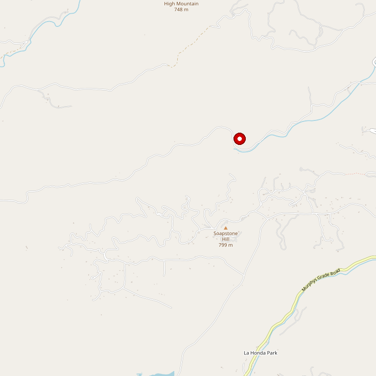

# Prospect 772

> *25-acre estate with Wine Spectator ratings and live music*

## Location

## Overview

| Field | Value |
|-------|-------|
| **Location** | Angels Camp, Calaveras County |
| **AVA** | Calaveras County |
| **Property** | 25 acres |
| **Style** | Estate, high-rated |
| **Focus** | Wine Spectator rated wines |
| **Live Music** | Yes |
| **Weddings** | Yes |
| **Dog Friendly** | Yes |
| **Picnic Area** | Yes |

## Contact

- **Address:** 772 Appaloosa Road, Angels Camp, CA 95222
- **Website:** https://www.prospect772.com
- **Tasting Room:** Thursday–Sunday 11am–5pm

## Wines

### High-Rated Wines
- Wine Spectator rated
- Exceptional quality

## History

Nestled on a stunning 25-acre property, the winery offers a serene setting for wine lovers to relax and explore.

## Notes

No reservations required. The winery hosts private events, weddings, and live music, creating a vibrant atmosphere.

Exceptional wines have earned **high ratings from Wine Spectator**.

## Visited

- [ ] Have not visited

## Rating

*Not yet rated*

---

*Last updated: 2026-03-21*
