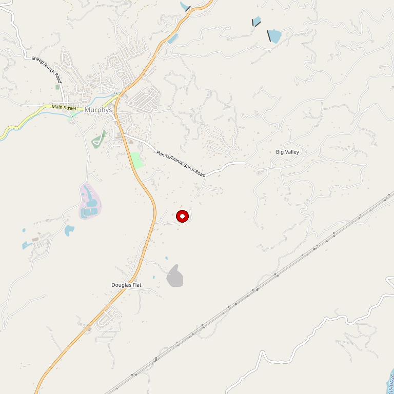

# Stevenot Winery

> *Three decades of Sierra Foothills winemaking heritage*

## Location

## Overview

| Field | Value |
|-------|-------|
| **Location** | Murphys & Vallecito, Calaveras County |
| **AVA** | Calaveras County |
| **Experience** | 30+ years |
| **Style** | Heritage, foothill climate |
| **Focus** | Estate wines |
| **Dog Friendly** | Yes |
| **Picnic Area** | Yes |

## Contact

### Downtown Murphys
- **Tasting Room:** Daily

### Vallecito Estate
- **Address:** 2849 Batten Road, Vallecito, CA 95251
- **Tasting Room:** Thursday–Monday 11am–4pm

- **Website:** https://stevenotwinery.com

## Wines

### Estate Wines
- Sierra Foothills varietals
- Wines exemplifying foothill climate and vineyards

## History

Producing Sierra Foothills wines for over three decades, each Stevenot wine exemplifies the rich history, excellent foothill climate, and impeccable vineyards of Calaveras County.

## Notes

Two locations: downtown tasting room open daily, vineyard property open weekends. The Vallecito estate offers the complete winery experience.

## Visited

- [ ] Have not visited

## Rating

*Not yet rated*

---

*Last updated: 2026-03-21*
