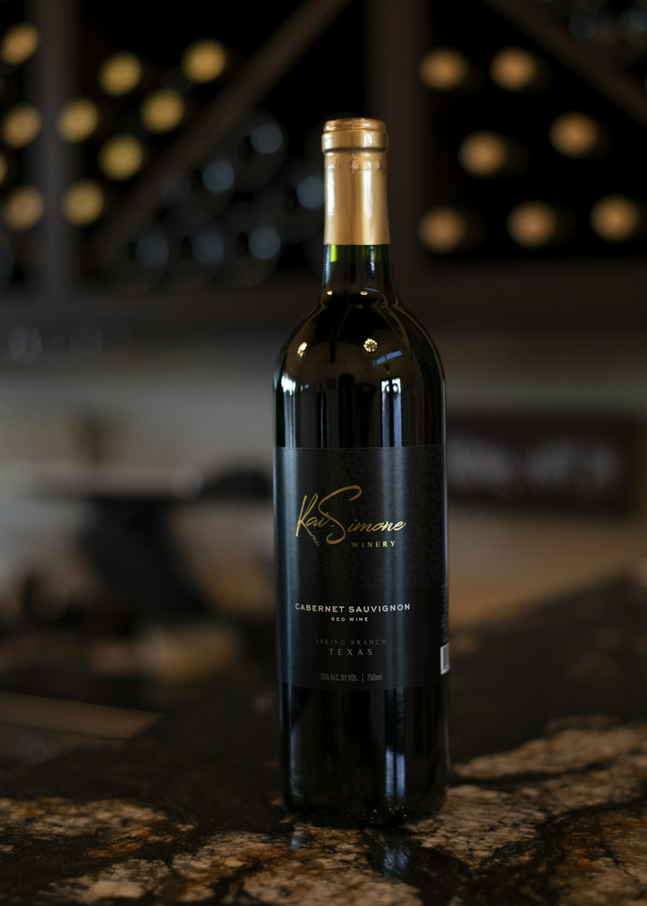

# Tanner Vineyards

> *Sierra Foothills family since the mid-1800s*

## Location

## Overview

| Field | Value |
|-------|-------|
| **Location** | Murphys, Calaveras County |
| **AVA** | Calaveras County |
| **Family Since** | Mid-1800s |
| **Style** | Estate-grown, handcrafted |
| **Focus** | Estate wines |
| **Dog Friendly** | Yes |
| **Picnic Area** | Yes |

## Contact

- **Address:** 435 Main Street #3, Murphys, CA 95247
- **Website:** https://tannervineyards.com
- **Tasting Room:** Sunday–Monday & Thursday 12pm–4pm, Friday 12pm–5pm, Saturday 11am–5:30pm (Closed Tuesday & Wednesday)

## Wines

### Estate-Grown
- Handcrafted wines
- Wines they "love to make and share with friends"

## History

The Tanner family has lived and worked in the Sierra Foothills since the **mid-1800s** — over 170 years of foothill heritage. Their estate-grown, handcrafted wines carry this deep connection to place.

## Notes

Located on Main Street next to the Murphys Hotel. The family's multi-generational roots in the Sierra Foothills distinguish Tanner from newcomers.

## Visited

- [ ] Have not visited

## Rating

*Not yet rated*

---

*Last updated: 2026-03-21*
