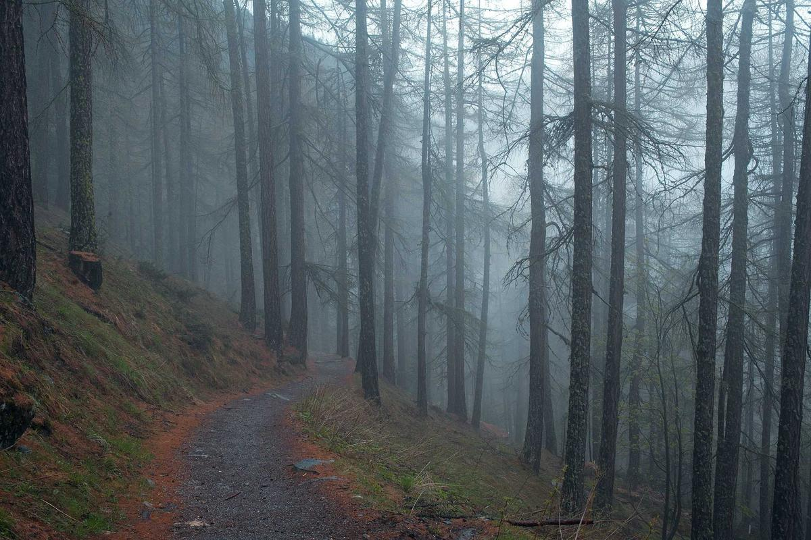

# Vina Moda Winery

> *20 years of winemaking experience in beautiful stone tasting room*

## Location

## Overview

| Field | Value |
|-------|-------|
| **Location** | Murphys, Calaveras County |
| **AVA** | Calaveras County |
| **Owner/Winemaker** | Nathan Vader (with wife Dre) |
| **Experience** | 20+ years |
| **Style** | Traditional meets innovative |
| **Focus** | Premium vineyard wines |
| **Dog Friendly** | Yes |
| **Picnic Area** | Yes |

## Contact

- **Address:** 147 Main Street, Murphys, CA 95247
- **Website:** https://vinamoda.com
- **Tasting Room:** Thursday–Tuesday 12pm–4pm/5pm

## Wines

### Premium Wines
- Hand-crafted from premium vineyards
- Award-winning

## History

Winemaker Nathan Vader was born in the Rocky Mountains and raised on a ranch, learning agriculture early. Upon moving to California, he discovered a passion for winemaking.

With over **20 years of winemaking experience**, Nathan continues to pride himself on hand-crafting exquisite wines from premium vineyards — challenging himself to make each harvest better than the last, honoring traditional winemaking techniques while introducing new innovations.

## Notes

The beautiful stone tasting room provides an elegant setting for award-winning wines.

### SF Chronicle Wine Competition Success
Multiple medals at San Francisco Chronicle Wine Competition — the competition was fierce with 65 judges evaluating nearly 6,700 wines from 1,000+ wineries:
- **Best in Class:** 2017 Sierra Foothills Syrah (judge: Mike Dunne, Sacramento Bee)
- **Best of Class:** 2018 Sierra Foothills Vinas Mourvèdre Red Blend

Nathan's background on a Rocky Mountain ranch gave him early agriculture skills. Upon moving to California, he discovered winemaking and never looked back.

## Visited

- [ ] Have not visited

## Rating

*Not yet rated*

---

*Last updated: 2026-03-21*
