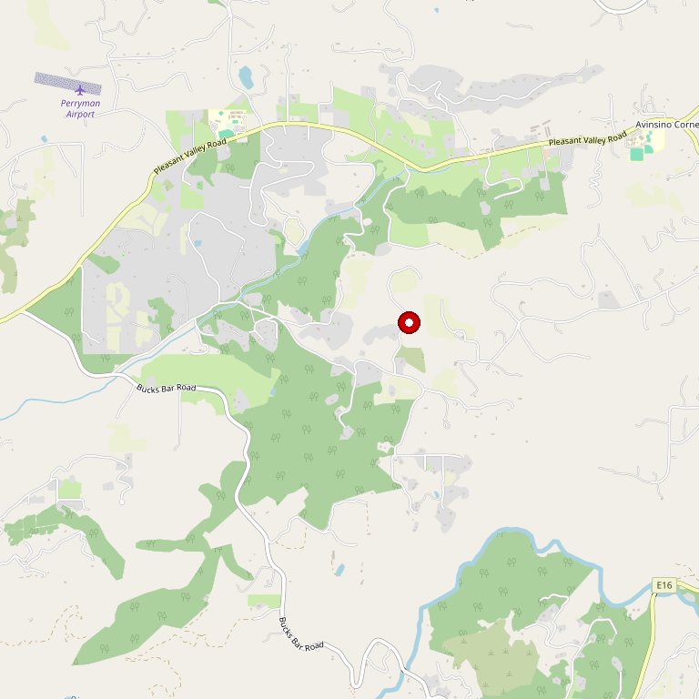

# Château Davell

> *Small lot, handcrafted wines with organic and biodynamic practices*

## Location

## Overview

| Field | Value |
|-------|-------|
| **Location** | Camino, El Dorado County |
| **AVA** | El Dorado (Apple Hill) |
| **Elevation** | 3,000 ft |
| **Style** | Old-world methods, new-world style |
| **Focus** | Small lot, handcrafted |
| **Farming** | Organic/Biodynamic practices |
| **Dog Friendly** | Yes |
| **Kid Friendly** | Yes |
| **Picnic Area** | Yes |

## Contact

- **Address:** 3020 Vista Tierra Drive, Camino, CA 95709
- **Phone:** (530) 644-2016
- **Website:** https://chateaudavell.com
- **Tasting Room:** Daily 11am–5pm

## Wines

### Reds
- Small lot handcrafted varietals
- Unfiltered, unfined
- Free of dyes and artificial additives

### Whites
- Estate whites

## Signature Wines

All Château Davell wines are produced using organic and biodynamic practices. The wines are:
- **Unfiltered**
- **Unfined**
- **Free of dyes and artificial additives**

## Vineyards

The estate sits at 3,000 feet elevation, nestled among the beautiful pines of the Apple Hill region. This high elevation creates unique growing conditions.

The winery has relationships with local growers who share their commitment to sustainable practices.

## History

Château Davell is a small family vineyard and winery in El Dorado Wine Country. The winery was founded with a vision of combining old-world winemaking methods with new-world style — producing extremely small lots of handcrafted wines.

## Notes

Château Davell prides itself on being family-friendly while maintaining high quality standards. Their commitment to organic and biodynamic practices sets them apart in the region.

The winery produces wines without filtering or fining, allowing the full character of the grapes to shine through.

## Visited

- [ ] Have not visited

## Rating

*Not yet rated*

---

*Last updated: 2026-03-21*
