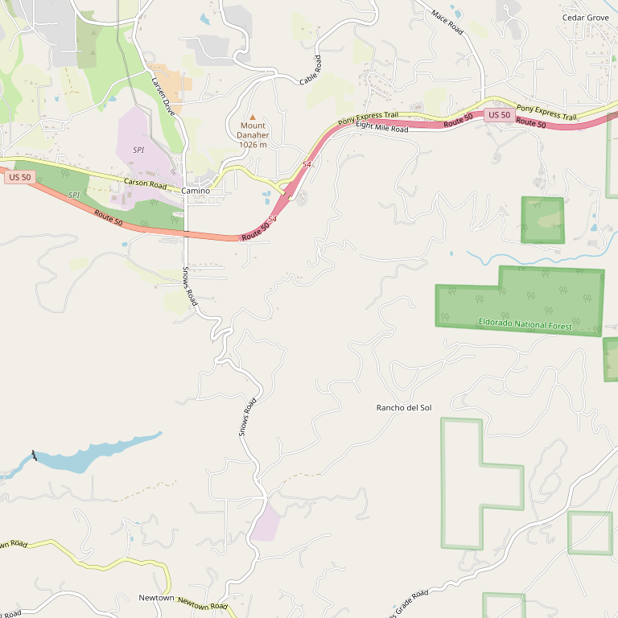

# Crystal Basin Cellars

> *Family-friendly Apple Hill destination with 20+ varieties*

## Location

## Overview

| Field | Value |
|-------|-------|
| **Location** | Camino, El Dorado County |
| **AVA** | El Dorado (Apple Hill) |
| **Style** | Fruit-forward, small batch |
| **Focus** | Diverse varietals, reds |
| **Price Range** | $$ |
| **Dog Friendly** | Yes |
| **Kid Friendly** | Yes |
| **Picnic Area** | Yes |

## Contact

- **Address (Camino):** 3550 Carson Road, Camino, CA 95709
- **Address (Folsom):** 813 Sutter Street, Folsom, CA 95630
- **Phone:** (530) 647-1767
- **Website:** https://crystalbasin.com
- **Tasting Room (Camino):** Daily 11am–5pm
- **Tasting Room (Folsom):** Thursday–Monday 12pm–6pm

## Wines

### Reds
- Over 20 varieties available
- Zinfandel
- Cabernet Sauvignon
- Petite Sirah
- Various blends

### Whites
- 2 white varieties
- Bubbly/Sparkling

## Signature Wines

Crystal Basin makes small batches of rich, fruit-forward wines spanning over 20 red varieties — one of the most diverse portfolios in the region.

## History

Crystal Basin Cellars is a destination winery right off Highway 50 in El Dorado County's beautiful Apple Hill region. The winery has built a loyal following through their welcoming approach and diverse wine selection.

## Notes

Crystal Basin is known for being exceptionally family-friendly — "Kids, dogs, grandpas, grandmas, aunts, uncles and cousins are all welcome."

The Camino location is part of a cluster of four tasting rooms, making it easy to park and explore multiple wineries in one visit.

For those who can't make it to the Sierra Foothills, the Folsom tasting room provides convenient access to Crystal Basin wines.

### The Vibe
**Rustic winery and bistro** — beautiful yet very family-friendly (and dog-friendly). Stay for the day and play games in the park, or take a mental health break with fantastic wines and foothill hospitality.

**Reviewer experience:** "Super friendly owners and staff. They had us tasting lots of wines not on the list. We ended up buying six bottles (considering we don't have much room in the RV)."

Staff members Mike, Barbara, and KZ are specifically praised for creating a welcoming atmosphere.

## Visited

- [ ] Have not visited

## Rating

*Not yet rated*

---

*Last updated: 2026-03-21*
