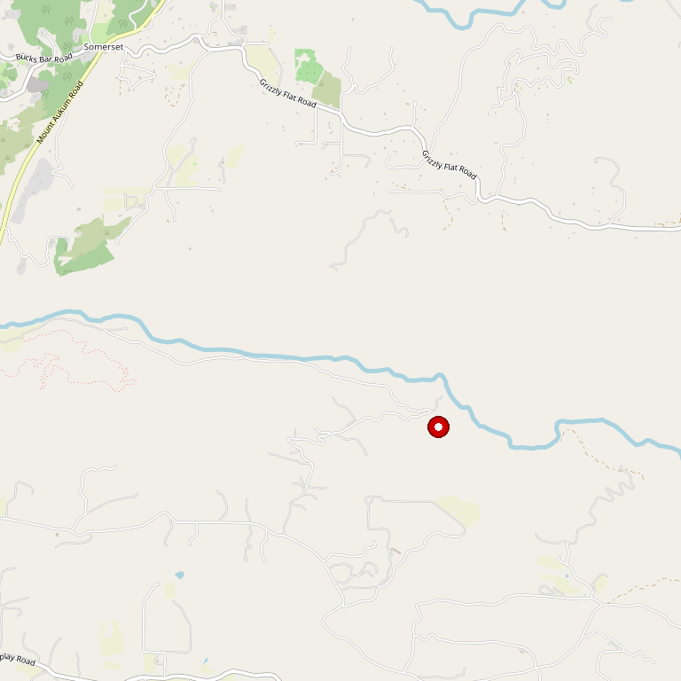

# E16 Winery

> *Russian River Pinot Noir meets Fair Play Rhône in a hillside cavern*

## Location

## Overview

| Field | Value |
|-------|-------|
| **Location** | Somerset, El Dorado County |
| **AVA** | Fair Play |
| **Founder** | Robert Jones |
| **Elevation** | ~2,400 ft |
| **Style** | Cool-climate Pinot Noir + mountain Rhône |
| **Focus** | Pinot Noir (Russian River), Syrah, Grenache Blanc |
| **Dog Friendly** | Yes |
| **Picnic Area** | Yes |

## Contact

- **Address:** 8085 Perry Creek Road, Somerset, CA 95684
- **Phone:** (530) 620-6200
- **Website:** https://e16wines.com
- **Tasting Room:** Friday–Sunday 11am–5pm

## Wines

### E16 Label (Russian River/Monterey)
- **Pinot Noir** — Multiple bottlings, all rated 90+ points
- Sourced from Russian River Valley and Santa Lucia Highlands

### Firefall Label (Fair Play Estate)
- **Syrah** — Baby Rattlesnake Vineyard
- **Grenache Blanc**
- Rhône varietals from estate vineyards

## Signature Wines

**E16 Pinot Noir** — All bottlings rated 90 points or higher. Sourced from premium Russian River Valley and Santa Lucia Highlands vineyards.

**Baby Rattlesnake Syrah** — Estate-grown from the Fair Play AVA, named for a vineyard where the sun appears to fall like fire while setting behind the western hills.

## Vineyards

The Fair Play estate vineyards include the Baby Rattlesnake Vineyard, located five miles south of Somerset above the middle fork of the Cosumnes River. The growing season is marked by warm, dry conditions ideal for Rhône varieties.

Robert Jones purchased the estate vineyards to honor his grandfather's winegrowing legacy. The property is farmed sustainably with year-round attention to each vine.

## History

E16 represents the intersection of two California wine regions: the cool-climate Russian River Valley (Pinot Noir) and the high-elevation Fair Play AVA (Rhône varieties).

Founder Robert Jones took wine classes at UC Davis Extension and studied cool-climate Pinot Noir production in the Russian River Valley during the early 1990s. With E16 firmly established among critics, he expanded into Rhône varietals from his El Dorado County estate under the Firefall label.

The name "Firefall" was inspired by the sunset view from Baby Rattlesnake Vineyard, where the setting sun creates the appearance of fire falling behind the hills.

## Notes

The winery offers unique visitor experiences in two venues:
- **Tasting Room** — Relaxed, charming atmosphere
- **Subterranean Cavern** — Built into the hillside

The property features a wooded creek with a charming footbridge and shaded terrace.

Both E16 and Firefall wines are served at the Somerset location, making this a two-for-one destination.

## Visited

- [ ] Have not visited

## Rating

*Not yet rated*

---

*Last updated: 2026-03-21*
