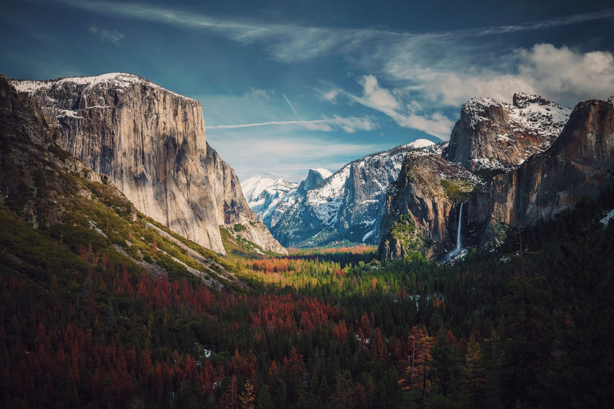

# Element 79 Vineyards

> *"A country club for wine drinkers" in Gold Country*

## Location

## Overview

| Field | Value |
|-------|-------|
| **Location** | Somerset, El Dorado County |
| **AVA** | Fair Play |
| **Acres** | 70-acre estate, 32 acres planted |
| **Elevation** | 2,400 ft |
| **Style** | Estate-grown, lifestyle destination |
| **Focus** | Cabernet Sauvignon, Petite Sirah, Viognier |
| **Dog Friendly** | Yes |
| **Picnic Area** | Yes |

## Contact

- **Address:** 7350 Fairplay Road, Somerset, CA 95684
- **Phone:** (530) 497-0750
- **Website:** https://www.element79vineyards.com
- **Tasting Room:** Daily 11am–5pm

## Wines

### Reds
- **Cabernet Sauvignon** — 5 acres planted (upper vineyard)
- **Petite Sirah** — 5 acres planted (upper vineyard)
- **Cabernet Franc** — 2 acres (lower vineyard)
- **Tempranillo**
- Estate blends

### Whites
- **Viognier** — 2.5 acres (upper vineyard)

## Signature Wines

**Estate Cabernet Sauvignon** — From 2,400 feet elevation in the heart of Fair Play, showing the potential for mountain Bordeaux varietals.

**Petite Sirah** — Bold and structured, benefiting from the high-elevation growing conditions.

## Vineyards

The 70-acre estate has 32 acres planted to vines across two distinct blocks:

**Upper Vineyard:**
- 5 acres Cabernet Sauvignon
- 5 acres Petite Sirah
- 2.5 acres Viognier

**Lower Vineyard:**
- 2 acres Cabernet Franc
- 1+ acres additional plantings

The property is nestled in the rolling hills of El Dorado County, deep in California Gold Country. The Fair Play AVA has the distinction of being one of California's highest-elevation wine regions.

## History

Element 79 Vineyards was "born of our love of wine, winemaking, and the opportunity to follow our dreams and immerse ourselves in the winemaker lifestyle."

The name "Element 79" refers to gold's atomic number — a fitting nod to the Gold Rush heritage of El Dorado County.

## Notes

The winery describes itself as "a country club for wine drinkers" — emphasizing the lifestyle and community aspect of wine enjoyment over mere production.

The location in the heart of Fair Play provides sweeping views of the surrounding rolling hills.

## Visited

- [ ] Have not visited

## Rating

*Not yet rated*

---

*Last updated: 2026-03-21*
