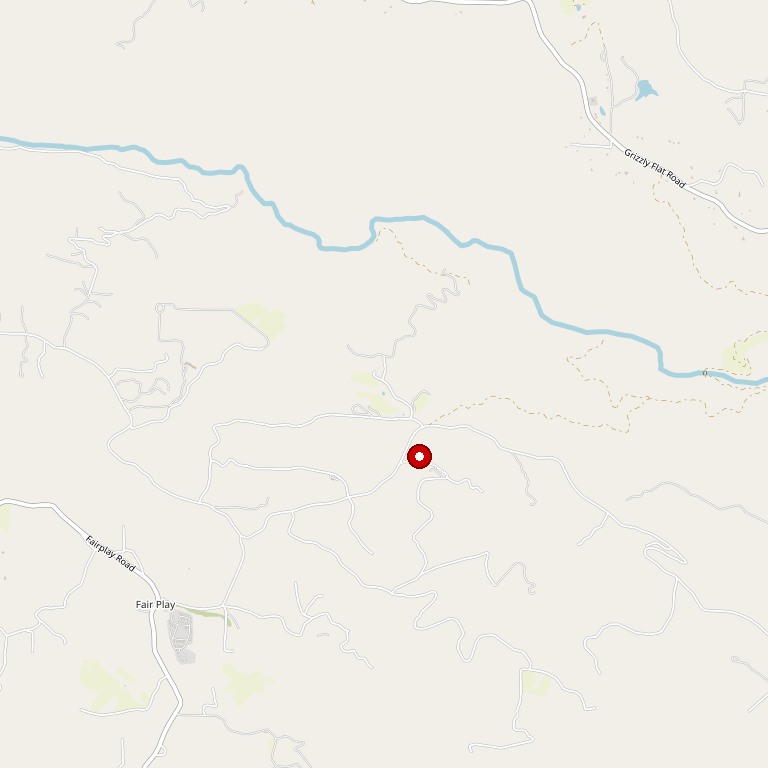

# Fenton Herriott Vineyards

> *Complex yet infinitely drinkable wines from Placerville*

## Location

## Overview

| Field | Value |
|-------|-------|
| **Location** | Placerville, El Dorado County |
| **AVA** | El Dorado |
| **Acres** | 5+ acres vineyard on 11-acre property |
| **Style** | Complex, drinkable |
| **Focus** | Estate varietals |
| **Dog Friendly** | Yes |
| **Picnic Area** | Yes |

## Contact

- **Address:** 120 Jacquier Court, Placerville, CA 95667
- **Phone:** (530) 626-6877
- **Website:** https://fentonherriott.com
- **Tasting Room:** Check website for hours

## Wines

### Reds
- Estate varietals
- El Dorado County Fair Wine Winners

### Whites
- Estate white varietals

## Signature Wines

Fenton Herriott has received El Dorado County Fair Wine Awards, demonstrating the quality achievable from their Placerville estate.

## Vineyards

The winery chose to plant vines amidst the steady sun and rich soil of Placerville. The 5+ acre vineyard sits on an 11-acre property, providing room for both viticulture and hospitality.

## History

Fenton Herriott Vineyards was established by founders with "a great passion for wine." They selected Placerville for its ideal growing conditions.

In 2024, the winery was sold for $2 million, indicating the value of the property and established business.

## Notes

The winery describes its wines as "complex yet infinitely drinkable" — a balance that many winemakers seek but few achieve. Wine club members receive discounts and special access to events.

While still a relatively new winery, Fenton Herriott has earned recognition at county competitions.

## Visited

- [ ] Have not visited

## Rating

*Not yet rated*

---

*Last updated: 2026-03-21*
