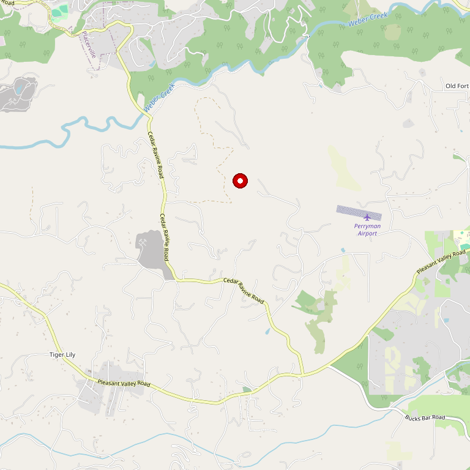

# Grace Patriot Wines (Lewis Grace Winery)

> *Handcrafted big wines from ridgetop red soils since 2004*

## Location

## Overview

| Field | Value |
|-------|-------|
| **Location** | Placerville, El Dorado County |
| **AVA** | El Dorado (Apple Hill) |
| **Founded** | 2004 |
| **Style** | Handcrafted, big wines |
| **Focus** | Reds, whites, sparkling |
| **Dog Friendly** | Yes |
| **Picnic Area** | Yes |

## Contact

- **Address:** 2701 Carson Road, Placerville, CA 95667
- **Phone:** (530) 626-7047
- **Website:** https://gracepatriotwines.com
- **Tasting Room:** Check website for hours

## Wines

### Reds
- **Pinot Noir** — 2022 current release
- Red blends

### Whites
- **Pinot Gris** — 2024 current release

### Sparkling
- **Brut Rosé Sparkling** — 2023 current release

## Vineyards

The estate sits at a ridgetop location in El Dorado County, with rich red soils that contribute to the character of their "big wines."

## History

Since 2004, Grace Patriot Wines has handcrafted wines from the rich red soils at their ridgetop location in El Dorado County. The winery has built a reputation for wines with presence and character.

## Notes

Grace Patriot offers an exceptional selection spanning reds, whites, and sparkling varieties. The Brut Rosé Sparkling is particularly noteworthy for the region.

## Visited

- [ ] Have not visited

## Rating

*Not yet rated*

---

*Last updated: 2026-03-21*
