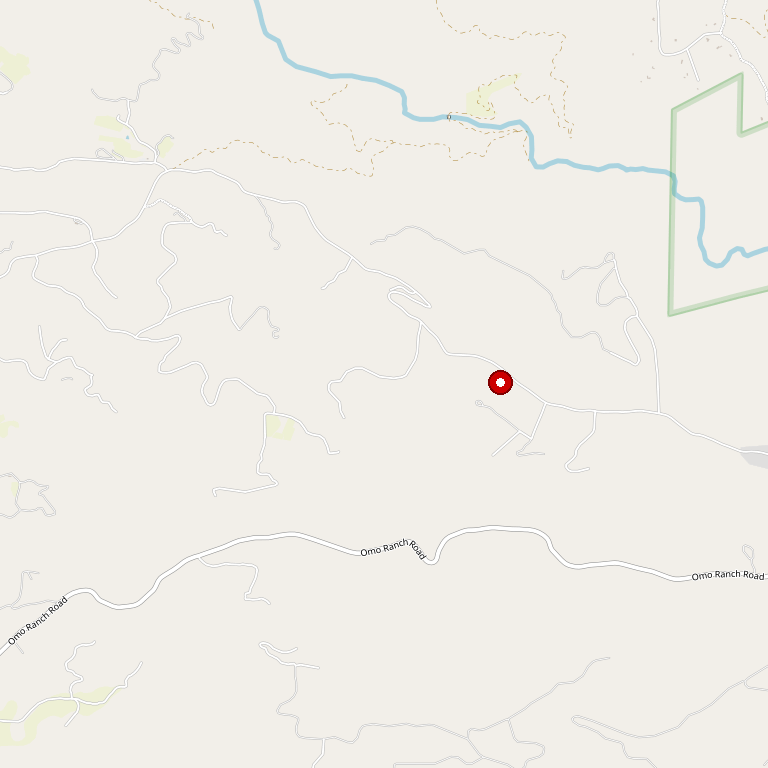

# Illuminare Estate

> *Frank Herbert Memorial Award winner for best Zinfandel*

## Location

## Overview

| Field | Value |
|-------|-------|
| **Location** | Camino, El Dorado County |
| **AVA** | El Dorado (Apple Hill) |
| **Style** | Bold yet balanced |
| **Focus** | Zinfandel, Estate wines |
| **Dog Friendly** | Yes |
| **Picnic Area** | Yes |

## Contact

- **Address:** 3500 Carson Road, Camino, CA 95709
- **Phone:** (530) 647-1884
- **Website:** http://www.illuminarewinery.com
- **Tasting Room:** Monday–Thursday 10am–5pm, Friday–Saturday 10am–8pm, Sunday Closed

## Wines

### Reds
- **Zinfandel** — Award-winning, vineyard designated
- Cabernet Sauvignon
- Estate blends

### Whites
- Estate white varietals

## Signature Wines

**Zinfandel Thaddeus Vineyard** — Won the Frank Herbert Memorial Award, sponsored by the El Dorado Wine Grape Growers, for the best Zinfandel made with El Dorado or Fair Play appellation grapes.

The wines are described as "bold, healthy wine that does not have unmanageable tannins" — showing the balance possible in the Sierra Foothills.

## Vineyards

Illuminare sources grapes from select Fair Play vineyards, including the Thaddeus Vineyard which produces their award-winning Zinfandel.

## History

Illuminare Estate has built a reputation for crafting exceptional Zinfandel from El Dorado County fruit. The Frank Herbert Memorial Award validated their place among the region's top producers.

## Notes

The extended Friday and Saturday hours (until 8pm) make Illuminare a good choice for evening visits — unusual in the Apple Hill area where most tasting rooms close at 5pm.

## Visited

- [ ] Have not visited

## Rating

*Not yet rated*

---

*Last updated: 2026-03-21*
