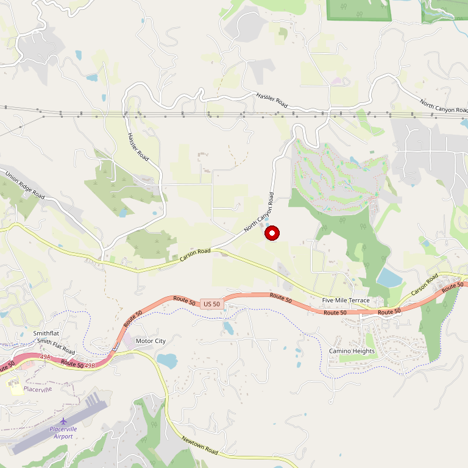

# Lava Cap Winery

> *Third-generation family winery on volcanic soils at 2,700 feet*

## Location

## Overview

| Field | Value |
|-------|-------|
| **Location** | Placerville, El Dorado County |
| **AVA** | El Dorado (Apple Hill area) |
| **Founded** | 1981 (vineyard), 1986 (winery) |
| **Owners** | Jones Family |
| **Elevation** | 2,700 ft |
| **Style** | Mountain-grown, volcanic terroir |
| **Focus** | Estate varietals |
| **Price Range** | $$ |
| **Dog Friendly** | Yes |
| **Picnic Area** | Yes |

## Contact

- **Address:** 2221 Fruitridge Road, Placerville, CA 95667
- **Phone:** (530) 621-0175
- **Website:** https://www.lavacap.com
- **Tasting Room:** Check website for current hours

## Wines

### Reds
- **Cabernet Sauvignon** — Estate grown
- **Zinfandel**
- **Petite Sirah**
- **Merlot**
- **Syrah**

### Whites
- **Chardonnay**
- **Viognier**
- **Sauvignon Blanc**

### Specialty
- **Muscat Canelli** — Sweet/dessert style
- Various estate blends

## Signature Wines

**Estate Cabernet Sauvignon** — Showcases the unique volcanic terroir of the property. Intensely aromatic with deep, rich fruit character.

**Petite Sirah** — Bold and structured, benefiting from the high elevation growing conditions.

## Vineyards

The vineyards sit on a "lava cap" — a unique geological formation of volcanic soil weathered from ancient ash flows. The Jones family, being geologists, specifically selected this site for its exceptional growing conditions.

At 2,700 feet elevation, Lava Cap's vineyards are among the highest in California. The volcanic soils provide excellent drainage and mineral complexity, while the elevation ensures cool nights that preserve acidity and develop complex flavors.

## History

The Jones family planted their first vines in 1981, selecting their site based on geological expertise. They were drawn to this location's volcanic soils, recognizing their potential for producing distinctive wines.

The winery opened in 1986 and has remained family-owned for three generations. The name "Lava Cap" reflects the unique volcanic geology of the site — a "cap" of volcanic material that distinguishes this vineyard from surrounding granitic terrain.

## Notes

The combination of extreme elevation (among California's highest vineyards) and rare volcanic soils creates wines with a distinctive character — intensely aromatic and luscious with deep, rich fruit. The setting in the Apple Hill area makes this a popular destination.

## Visited

- [ ] Have not visited

## Rating

*Not yet rated*

---

*Last updated: 2026-03-21*
