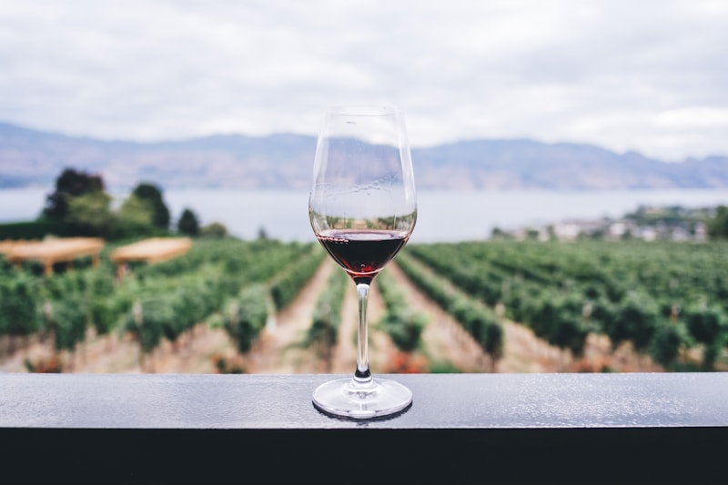
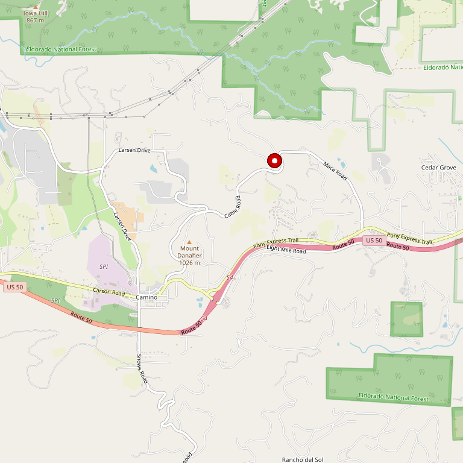

# Madroña Vineyards

> *High-elevation pioneers since 1973*

## Location

## Overview

| Field | Value |
|-------|-------|
| **Location** | Camino, El Dorado County |
| **AVA** | El Dorado (Apple Hill area) |
| **Founded** | 1973 |
| **Founders** | Dick and Leslie Bush |
| **Current Owners** | Paul and Maggie Bush |
| **Winemaker** | Paul Bush |
| **Acres** | 32+ (original planting) |
| **Elevation** | ~3,000 ft |
| **Style** | Estate-grown, mountain wines |
| **Focus** | Rhône, Bordeaux varietals |
| **Dog Friendly** | Yes |
| **Picnic Area** | Yes |

## Contact

- **Address:** 2560 High Hill Road, Camino, CA 95709
- **Phone:** (530) 644-5948
- **Website:** https://madronavineyards.com
- **Tasting Room:** Daily 11am–5pm

## Wines

### Reds
- **Syrah**
- **Cabernet Sauvignon**
- **Merlot**
- **Zinfandel**
- **Petite Sirah**

### Whites
- **Chardonnay**
- **Viognier**
- **Gewürztraminer**
- **Riesling**

### Specialty
- Estate blends
- Late harvest wines

## Signature Wines

**Estate Syrah** — Showcases the potential of high-elevation Sierra Foothills Rhône varieties.

**Gewürztraminer** — The high elevation (3,000 ft) creates perfect conditions for this aromatic variety, which thrives in cooler climates.

## Vineyards

The estate vineyards sit at approximately 3,000 feet elevation near Apple Hill — among the highest vineyard plantings in California. This extreme elevation creates extended hang time, pronounced diurnal temperature swings, and wines with excellent acidity and complexity.

Dick Bush, the founder, held a doctorate in metallurgical engineering from Stanford but left his career to pursue his passion for high-elevation viticulture.

## History

Madroña Vineyards was founded in 1973 when Dick and Leslie Bush planted 32 acres of vines at approximately 3,000 feet elevation. They were true pioneers — among the first to recognize the potential for high-elevation grape growing in El Dorado County.

The name "Madroña" comes from the native madrone trees that grow on the property. The winery has remained family-owned, now operated by son Paul Bush and his wife Maggie.

In 2018, Madroña celebrated 45 years in the wine business — a testament to the family's commitment and the quality of their mountain-grown wines.

## Notes

Owner/winemaker Paul Bush grew up working the vineyards — "doing whatever needed to be done," as he describes it, from vineyard work to manning the labeling machine. This hands-on family heritage shows in the attention to detail in every bottle.

The winery regularly hosts wine and beer pairing dinners and other entertaining events. Paul provides updates on growing and harvest seasons through the winery blog.

## Visited

- [ ] Have not visited

## Rating

*Not yet rated*

---

*Last updated: 2026-03-21*
