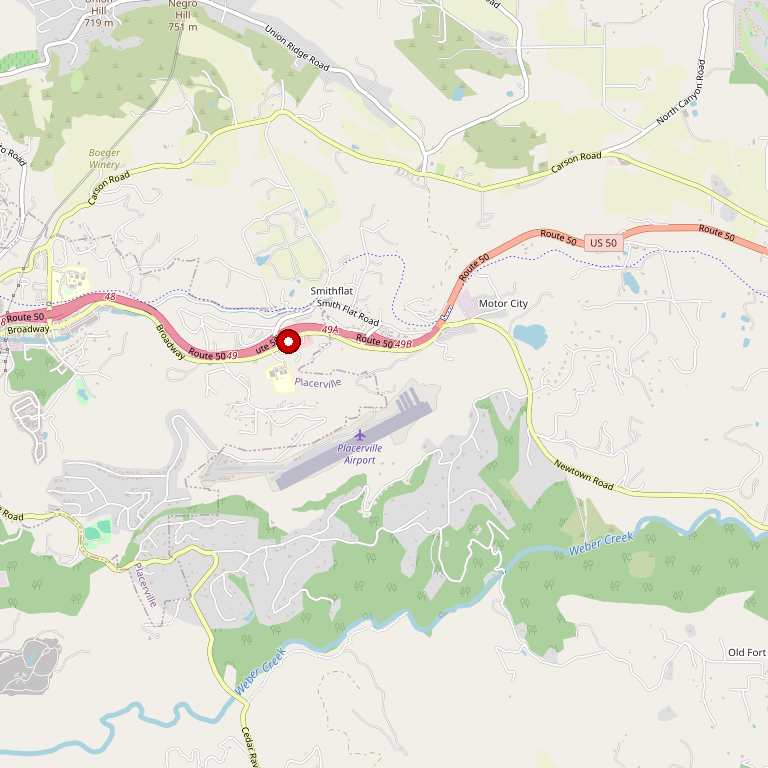

# Narrow Gate Vineyards

> *Demeter Certified Biodynamic® wines in a candle-lit cellar*

## Location

## Overview

| Field | Value |
|-------|-------|
| **Location** | Placerville, El Dorado County |
| **AVA** | El Dorado |
| **Certification** | Demeter Certified Biodynamic® |
| **Style** | Natural, minimal intervention |
| **Focus** | Rhône varietals |
| **Dog Friendly** | Yes |
| **Picnic Area** | Yes |

## Contact

- **Address:** 4282 Pleasant Valley Road, Placerville, CA 95667
- **Phone:** (530) 306-9454
- **Website:** https://www.narrowgatevineyards.com
- **Tasting Room:** Friday–Saturday 11am–5pm, Sunday 12pm–5pm

## Wines

### Reds
- Rhône style varietals
- Biodynamic red blends

### Whites
- Biodynamic white varietals

## Winemaking Philosophy

Narrow Gate is a **Demeter Certified Biodynamic® farm** — one of the most rigorous organic and sustainable certifications in agriculture. The winery produces wines through:
- Faith and passion
- Attention to detail
- Very little intervention by technology
- Genuine handmade craft

The estate builds and produces its own biodynamic compost from cows and chickens on the farm. Biodynamic preparations, pumice, and stems from wine production are tilled back into the vineyard rows to heal the soil and feed the vines.

## History

The name "Narrow Gate" has spiritual significance — referencing the biblical passage about the narrow gate that leads to life. The winery operates on the principle that the best wines come from healthy soil and minimal interference.

## Notes

The tasting experience is unique: visitors enter through historic barn wood cellar doors into a romantic, **candle-lit winery** where warm hospitality awaits alongside the wines.

Narrow Gate is described as a "hidden-gem winery" in the Sierra Foothills. For those interested in biodynamic and natural wines, this is essential visiting.

## Visited

- [ ] Have not visited

## Rating

*Not yet rated*

---

*Last updated: 2026-03-21*
