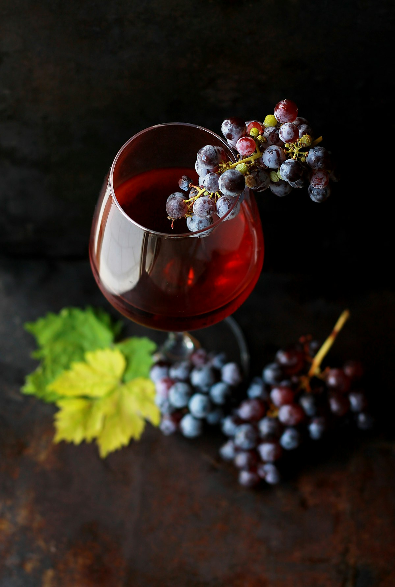
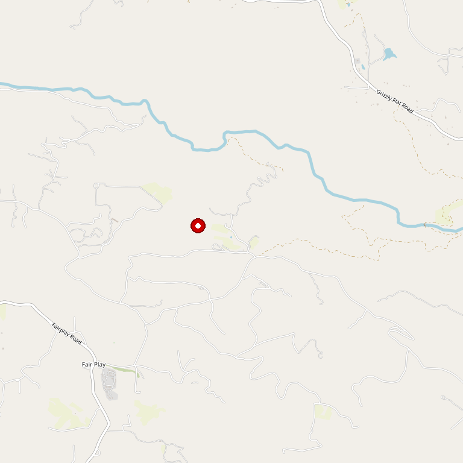

# Saluti Cellars

> *Romantic B&B inn and vineyard wedding venue*

## Location

## Overview

| Field | Value |
|-------|-------|
| **Location** | Somerset, El Dorado County |
| **AVA** | El Dorado |
| **Style** | Romantic, boutique |
| **Focus** | Estate wines, weddings, lodging |
| **Lodging** | Bed & Breakfast Inn |
| **Weddings** | Yes — premier venue |
| **Dog Friendly** | Check |
| **Picnic Area** | Yes |

## Contact

- **Address:** 7505 Grizzly Flat Road, Somerset, CA 95684
- **Website:** https://www.saluticellars.com
- **Tasting Room:** Check website for hours

## Wines

### Wines
- Estate varietals
- Small production wines

## Vineyards

Nestled in a secluded valley among towering pines, lush vineyards, and beautifully landscaped grounds, Saluti Cellars offers breathtaking panoramic views.

## History

Saluti Cellars has become the perfect destination for couples seeking a romantic escape or dream wedding venue in California wine country.

## Notes

Saluti Cellars operates as both a **winery** and a **bed & breakfast inn**, making it ideal for romantic getaways. The property is particularly known as a charming vineyard wedding and reception venue.

Located in the heart of Northern California's foothill wine country in Somerset, just a short drive from Placerville, Sacramento, and beyond.

## Visited

- [ ] Have not visited

## Rating

*Not yet rated*

---

*Last updated: 2026-03-21*
