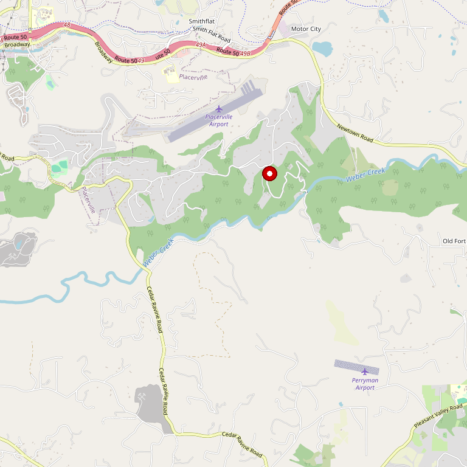

# Sierra Vista Vineyards & Winery

> *Rhône varietal pioneer — second oldest vineyard in El Dorado County*

## Location

## Overview

| Field | Value |
|-------|-------|
| **Location** | Placerville, El Dorado County |
| **AVA** | El Dorado (Pleasant Valley) |
| **Founded** | 1973 (vineyard), 1977 (winery) |
| **Founder** | John MacCready |
| **Elevation** | ~2,000 ft (Red Rock Ridge) |
| **Style** | Rhône-focused |
| **Focus** | Syrah, Grenache, Mourvèdre, Viognier |
| **Dog Friendly** | Yes |
| **Picnic Area** | Yes |

## Contact

- **Address:** 4560 Cabernet Way, Placerville, CA 95667
- **Phone:** (530) 622-7221
- **Website:** https://www.sierravistawinery.com
- **Tasting Room:** Daily 10am–5pm

## Wines

### Reds
- **Syrah** — Estate grown, flagship varietal
- **Grenache**
- **Mourvèdre**
- **GSM Blend** — Classic Rhône-style
- **Cabernet Sauvignon**
- **Zinfandel**

### Whites
- **Viognier** — Aromatic white
- **Roussanne**
- **Chardonnay**

### Rosé
- **Grenache Rosé**

## Signature Wines

**Estate Syrah** — Planted in 1979, Sierra Vista's Syrah traces its lineage to Chapoutier's vineyards in the Northern Rhône appellation of Côte-Rôtie. This is arguably one of the most historically significant Syrah plantings in California.

**El Dorado Red (GSM)** — A classic Grenache-Syrah-Mourvèdre blend showcasing the Rhône potential of the Sierra Foothills.

## Vineyards

The estate sits atop Red Rock Ridge in the Sierra Nevada foothills, only 30 miles from Lake Tahoe. The property experiences four different microclimates, contributing to the complexity of the wines.

Founder John MacCready made a formal study comparing the Northern Rhône Valley to El Dorado County and found striking similarities in climate, rainfall, and soil type. This research led to Sierra Vista's emphasis on Rhône varieties.

## History

John MacCready founded Sierra Vista in 1977, making it one of the first three El Dorado wineries of the modern wine era. His vineyard, planted in 1974, was among the earliest in the county's post-Prohibition revival.

MacCready was a true visionary. His research comparing El Dorado to the Northern Rhône led him to plant Syrah in 1979 — cuttings with lineage traced to Chapoutier's legendary Côte-Rôtie vineyards. This made Sierra Vista a pioneer in California Rhône movement.

The winery has won numerous awards from El Dorado County, the California State Fair, the Orange County Fair, and Amador County competitions.

## Notes

This is essential visiting for anyone interested in the history of Rhône varietals in California. The combination of pioneering history, estate-grown Rhône wines, and beautiful Pleasant Valley location makes Sierra Vista a cornerstone of El Dorado wine country.

The winery also serves as a wedding and event venue.

## Visited

- [ ] Have not visited

## Rating

*Not yet rated*

---

*Last updated: 2026-03-21*
