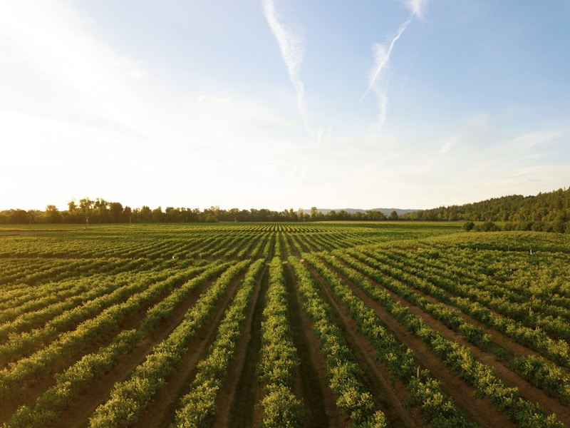
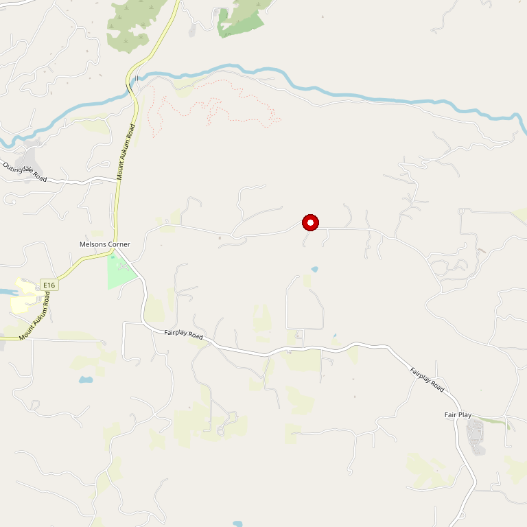

# Skinner Vineyards & Winery

> *A family legacy revived — from 1861 to today*

## Location

## Overview

| Field | Value |
|-------|-------|
| **Location** | Somerset, El Dorado County |
| **AVA** | Fair Play |
| **Founded** | 2007 (modern era) / 1861 (original) |
| **Owners** | Mike and Carey Skinner |
| **Winemaker** | Chris Pittenger |
| **Elevation** | ~2,400 ft |
| **Style** | Rhône varietals, estate-focused |
| **Focus** | Rhône varietals, Zinfandel |
| **Dog Friendly** | Yes |
| **Picnic Area** | Yes (park with picnic tables) |

## Contact

- **Address (Winery):** 8054 Fair Play Road, Somerset, CA 95684
- **Address (Green Valley Ranch):** 3790 Green Valley Road, Rescue, CA 95672
- **Phone:** (530) 620-2210
- **Website:** https://skinnervineyards.com
- **Tasting Room (Fairplay):** Thurs–Sun
- **Tasting Room (Green Valley):** Thurs–Sun 12pm–5pm

## Wines

### Reds
- **Mourvèdre** — Estate signature
- **Syrah**
- **Grenache**
- **GSM Blend**
- **Zinfandel**
- **Petite Sirah**

### Whites
- **Viognier**
- **Grenache Blanc**
- **Roussanne**

### Rosé
- **Grenache Rosé**

## Signature Wines

**Estate Mourvèdre** — Skinner has become known for producing exceptional single-varietal Mourvèdre, a rarity in California. Worth seeking out their vertical tastings.

**El Dorado Zinfandel** — Honors the region's Gold Rush heritage while showcasing modern winemaking.

## Vineyards

The estate includes two ranches: the main Wing Ranch in Fair Play and Green Valley Ranch in Rescue. Both feature sustainably farmed vineyards dedicated primarily to Rhône varieties.

Some vines on the property trace back to the original 1861 plantings by James Skinner, making them among the oldest in California.

## History

In 1861, James Skinner, a Scottish immigrant, established one of California's first wineries in El Dorado County. The winery operated until Prohibition, then faded into memory.

In 2007, Mike and Carey Skinner discovered their family connection to this pioneering legacy while exploring the Sierra Foothills. What began as a chance discovery became a mission to revive their family's winemaking heritage.

Today, Skinner Vineyards operates on land near where James Skinner planted his original vineyard over 160 years ago. A small block of those original vines reportedly remains on the property, making this a living link to California's earliest wine history.

The Skinners describe themselves as "true adventurers" — their winery represents the intersection of heritage, discovery, and place.

## Notes

The dual tasting room model allows visitors to experience Skinner wines in two distinct settings: the Fair Play estate (wing Ranch) and the more accessible Green Valley Ranch in Rescue. The Green Valley location is particularly welcoming, with guests invited to enjoy tastings seated inside, on the patio, or at picnic tables in the park.

The combination of genuine Gold Rush history, estate Rhône wines, and relaxed atmosphere makes this a must-visit.

## Visited

- [ ] Have not visited

## Rating

*Not yet rated*

---

*Last updated: 2026-03-21*
