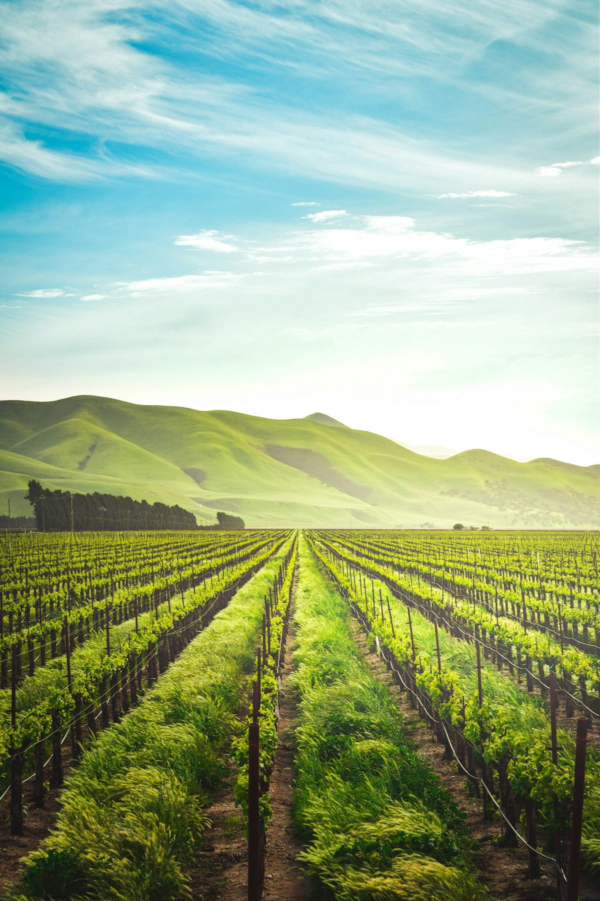
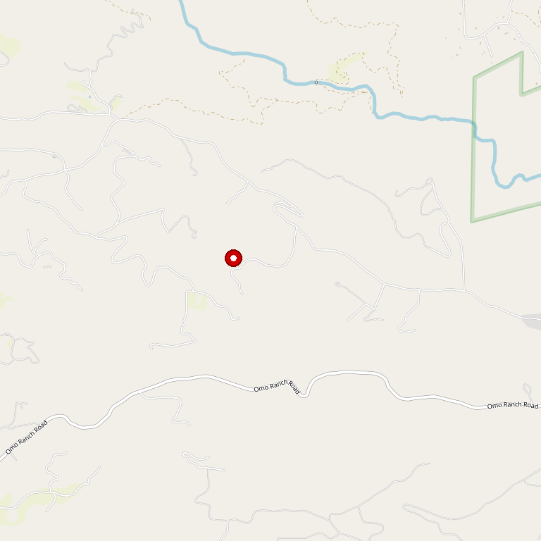

# Starfield Vineyards & Winery

> *Third-generation grower with 17 varieties on 31 estate acres*

## Location

## Overview

| Field | Value |
|-------|-------|
| **Location** | Placerville, El Dorado County |
| **AVA** | El Dorado (Apple Hill) |
| **Founded** | 2012 |
| **Founders** | Tom and Rob Sinton |
| **Acres** | 31 acres, 24 blocks |
| **Varieties** | 17 planted |
| **Elevation** | 2,400 ft |
| **Style** | Estate-focused, diverse varietals |
| **Focus** | Rhône varieties, diverse portfolio |
| **Dog Friendly** | Yes |
| **Picnic Area** | Yes |

## Contact

- **Address:** 2750 Jacquier Road, Placerville, CA 95667
- **Phone:** (530) 748-3085
- **Website:** https://www.starfieldvineyards.com
- **Tasting Room:** Daily 11am–5pm

## Wines

### Reds
- Rhône varietals
- Bordeaux varietals
- Estate red blends

### Whites
- Estate white varietals

The winery produces wines from 17 different varieties planted across 24 distinct blocks — one of the most diverse estate plantings in El Dorado County.

## Signature Wines

With 17 varieties to choose from, Starfield offers something for every palate. Their Rhône varieties are members of the Rhone Rangers organization.

## Vineyards

The estate sits on a 2,400-foot ridge in Apple Hill, where rows of vines roll downhill toward lakes, forest trails, and wide Sierra views. 31 acres are planted in 24 blocks with 17 varieties.

The mountain climate provides an ideal balance of warm days and cool nights that allow the grapes to develop delicate aromas and robust flavors.

## History

Starfield Vineyards was founded in 2012 by Tom and Rob Sinton. Tom is a third-generation grower, bringing deep agricultural heritage to the project.

The winery strives to craft wines and winery experiences that make visitors smile — a philosophy reflected in everything from vineyard management to hospitality.

## Notes

Located in the heart of Apple Hill, Starfield Vineyards is described as "the perfect weekend getaway." The combination of diverse wines, beautiful views of lakes and forest, and friendly atmosphere makes this worth the trip.

Recent years have been defining for the winery, building recognition and quality.

## Visited

- [ ] Have not visited

## Rating

*Not yet rated*

---

*Last updated: 2026-03-21*
