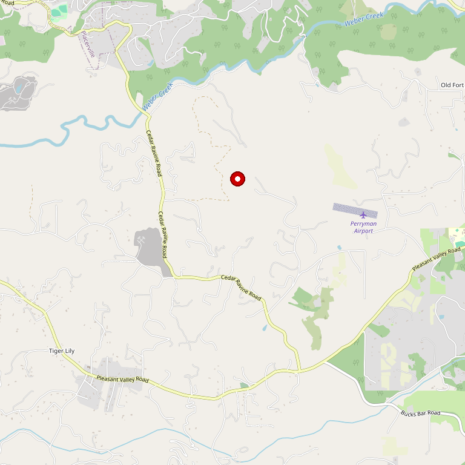

# Toogood Estate Winery

> *Wine Cave tastings — 5,000 sq ft of underground experience*

## Location

## Overview

| Field | Value |
|-------|-------|
| **Location** | Somerset, El Dorado County |
| **AVA** | Fair Play |
| **Founded** | 2001 |
| **Style** | Estate grown, cave aged |
| **Focus** | Wines and Ports |
| **Dog Friendly** | Yes |
| **Picnic Area** | Yes |

## Contact

- **Address:** 7280 Fairplay Road, Somerset, CA 95684
- **Phone:** (530) 620-3800
- **Website:** https://www.toogoodwinery.com
- **Tasting Room:** Daily (check website for hours)

## Wines

### Reds
- Estate grown varietals
- Cave-aged wines

### Ports
- Estate Port wines

### Whites
- Estate white varietals

## Signature Wines

The winery specializes in both dry wines and Port-style wines, all estate grown.

## Vineyards

Estate vineyards in the Fair Play AVA provide all the grapes for Toogood's wine production.

## History

Toogood Estate Winery was founded in 2001 in Fair Play, California. The name "Toogood" says it all — an aspirational promise about the quality of the wines.

## Notes

The star attraction is the **5,000 square foot Wine Cave** — visitors can taste wines and ports inside this unique underground space. The cave maintains perfect aging conditions year-round and creates an unforgettable tasting experience.

The front tasting area offers standard wines, but visitors are encouraged to venture into the cave where knowledgeable pourers (like Tom) can guide you through the full portfolio.

For wine club members, Toogood offers member-only events, wine-club discounts, and members-only wine selections.

## Visited

- [ ] Have not visited

## Rating

*Not yet rated*

---

*Last updated: 2026-03-21*
