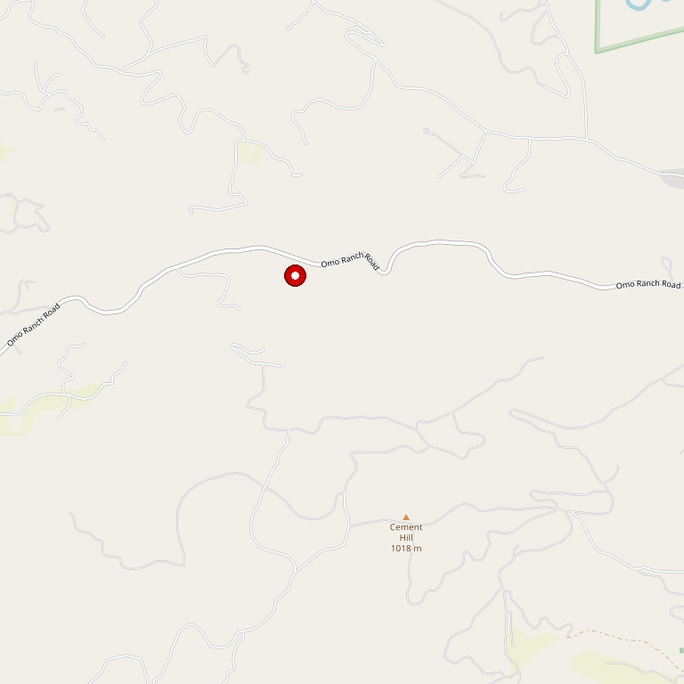

# Wofford Acres Vineyards

> *"Come for the wine. Stay for the view." — 29+ harvests of gold medals*

## Location

## Overview

| Field | Value |
|-------|-------|
| **Location** | Camino, El Dorado County |
| **AVA** | El Dorado (Apple Hill) |
| **Founded** | 2003 |
| **Owners** | Paul and Ann Wofford, Mike Wofford |
| **Winemaker** | Paul Wofford (29+ harvests experience) |
| **Style** | Award-winning, view-oriented |
| **Focus** | State Fair gold medal winners |
| **Dog Friendly** | Yes |
| **Picnic Area** | Yes |

## Contact

- **Address:** 1900 Hidden Valley Lane, Camino, CA 95709
- **Phone:** (530) 644-6200
- **Website:** https://wavwines.com
- **Email:** reservations@wavwines.com
- **Tasting Room:** Thursday–Monday 11am–4:45pm (reservations recommended on weekends)

## Wines

### Reds
- California State Fair gold medal winners
- Estate varietals

### Whites
- Estate whites

## History

After making gold medal-winning wines for 29 harvests, winemaker Paul Wofford moved to Camino in 2003 to start Wofford Acres Vineyards with his wife Ann and brother Mike.

The decades of experience paid off immediately: at the California State Fair, Wofford Acres Vineyards has received the **"Best of..." designation multiple times** — a testament to Paul's veteran winemaking skills.

## Notes

The winery's tagline says it all: **"Come for the Wine. Stay for the View."**

The Hidden Valley Lane location offers stunning views that make this a destination beyond just the tasting room. Reservations are recommended on weekends — email to request.

## Visited

- [ ] Have not visited

## Rating

*Not yet rated*

---

*Last updated: 2026-03-21*
