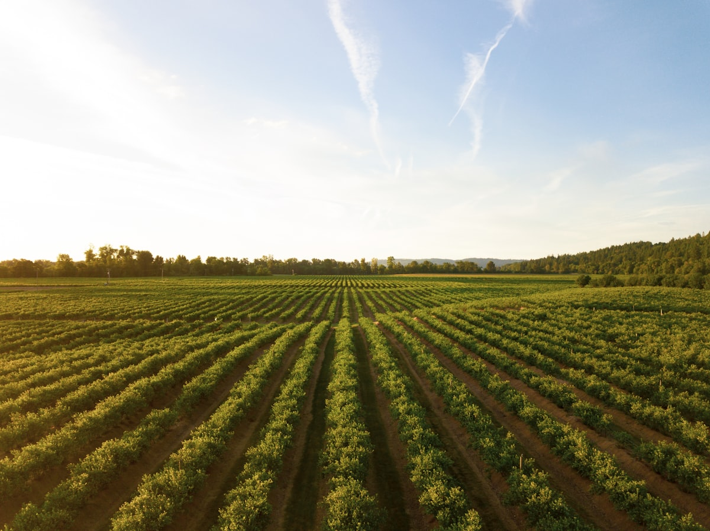
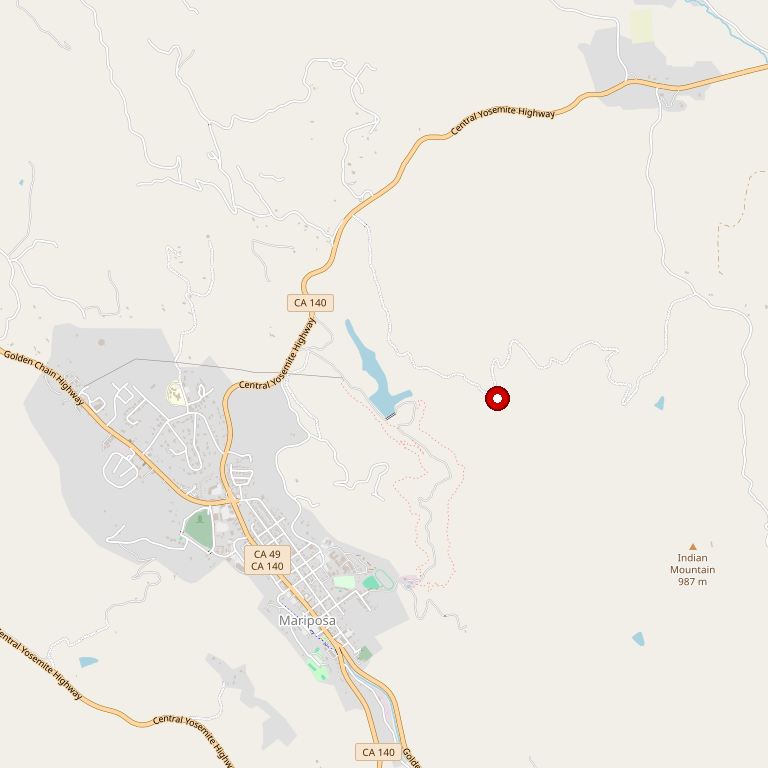

# Casto Oaks Fine Wine and Art

> *Mount Bullion Vineyard — "Best of the best in Mariposa"*

## Location

## Overview

| Field | Value |
|-------|-------|
| **Location** | Mount Bullion, Mariposa County |
| **AVA** | Sierra Foothills |
| **Vineyard** | Mount Bullion Vineyard |
| **Style** | Family winery with art |
| **Focus** | Cabernet, Zinfandel |
| **Dog Friendly** | Check |
| **Picnic Area** | Yes |

## Contact

- **Website:** https://www.castooakswine.com
- **Tasting Room:** Check website for hours

## Wines

### Reds
- **Cabernet Sauvignon** — Smooth cabs
- **Zinfandel** — Jammy zins

## Notes

"Casto Oaks provides the exciting new wine you can introduce to your friends and represents the **best of the best in Mariposa**."

From smooth cabs to jammy zins, this family winery produces great wines all from Mariposa County fruit.

## Visited

- [ ] Have not visited

## Rating

*Not yet rated*

---

*Last updated: 2026-03-21*
