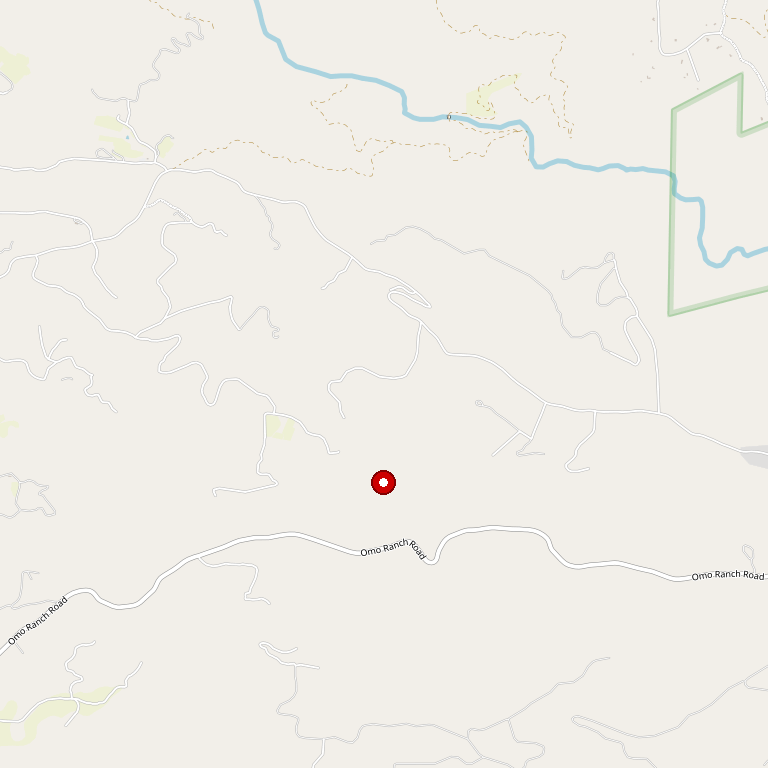

# Avanguardia Wines

> *"A varietal-free zone" — 20+ exotic crosses and rare varietals*

## Location

## Overview

| Field | Value |
|-------|-------|
| **Location** | Nevada City & Grass Valley, Nevada County |
| **AVA** | Sierra Foothills |
| **Style** | Premium blends, exotic varieties |
| **Focus** | Unusual and rare varietals |
| **Dog Friendly** | Yes |
| **Picnic Area** | Yes |

## Contact

- **Address (Winery):** 13028 Jones Bar Road, Nevada City, CA 95959
- **Address (Tasting Room):** Downtown Grass Valley
- **Phone:** (530) 274-9482
- **Website:** https://avanguardiawines.com
- **Tasting Room:** Saturday–Sunday 12pm–5pm (Grass Valley); Saturday 12pm–5pm (Winery)

## Wines

### Exotic Varietals
- **Flora** — UC Davis cross
- **Carmine** — UC Davis cross
- **Rkatsiteli** — Russian
- **Forastera** — Italian
- **Dolcetto** — Italian
- **Corvina** — Double Gold winner
- **Montepulciano**

### Blends
- 20+ Italian, Russian, French, and UC Davis crosses blended from estate vineyards

## Awards

- **Double Gold and Best of Class of Region** — 2013 Corvina
- **Silver** — Dolcetto Barbera
- **Bronze** — Montepulciano

## Philosophy

Avanguardia describes itself as **"a varietal-free zone"** — specializing in premium blended wines from unusual and exotic varieties rarely found in California.

## Notes

Complimentary tasting at the winery. Two locations: the downtown Grass Valley tasting room and the beautiful estate winery on Jones Bar Road.

Cannot be fully appreciated without a visit to the beautiful winery property.

## Visited

- [ ] Have not visited

## Rating

*Not yet rated*

---

*Last updated: 2026-03-21*
